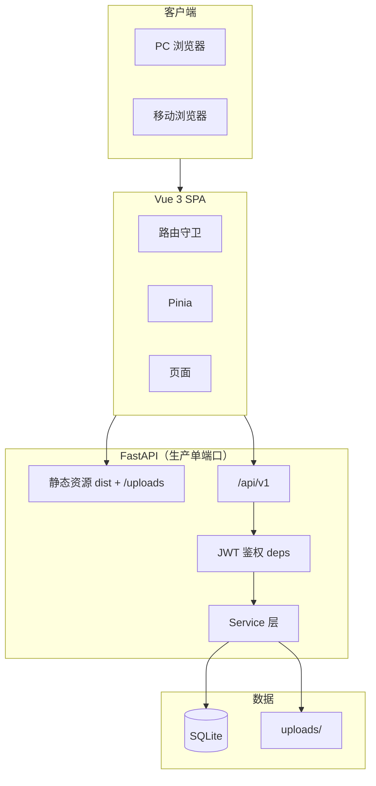
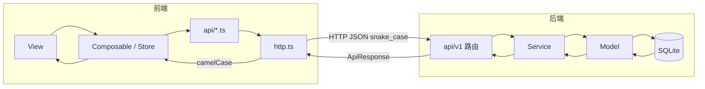
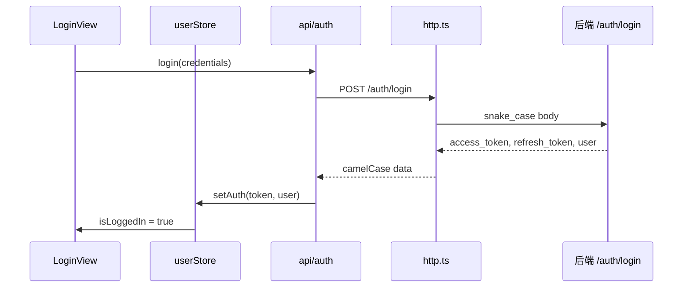
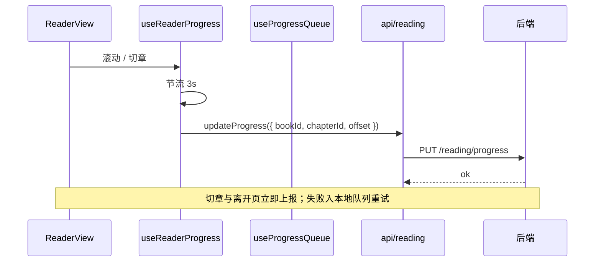
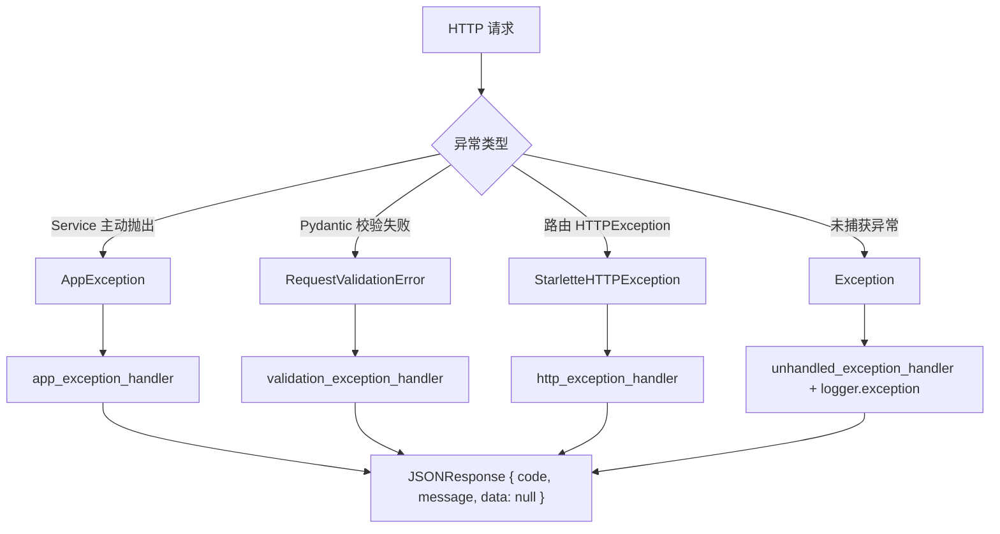

# 欲阅 · 架构设计

| 字段 | 内容 |
|------|------|
| 文档类型 | 架构设计（技术选型、系统架构、分层、数据流、部署形态） |
| 版本 | v1.0 |
| 最后更新 | 2026-07-03 |

> 本文描述「系统怎么搭起来的」。与 [欲阅需求分析.md](../欲阅需求分析.md) §2 一致，但补充代码级细节。

---

## 目录

1. [技术选型与理由](#1-技术选型与理由)
2. [系统架构](#2-系统架构)
3. [分层架构与职责](#3-分层架构与职责)
4. [数据流](#4-数据流)
5. [认证与安全架构](#5-认证与安全架构)
6. [异常处理架构](#6-异常处理架构)
7. [部署形态](#7-部署形态)
8. [扩展性设计](#8-扩展性设计)

---

## 1. 技术选型与理由

| 层级 | 选型 | 选型理由 |
|------|------|----------|
| 前端框架 | Vue 3 + TypeScript + Vite | Composition API 适合阅读器这类状态密集页面；TS 提升类型安全；Vite 启动快 |
| 路由/状态 | Vue Router 4 + Pinia | 守卫支持懒加载与角色控制；Pinia 轻量 |
| HTTP | Axios | 拦截器统一做字段转换、Token、错误处理 |
| 后端框架 | FastAPI | 类型注解生成 OpenAPI 文档，前后端对齐成本低 |
| ORM | SQLAlchemy 2.x | 模型即表结构；2.x 类型注解风格 |
| 数据库 | SQLite | 零配置、单文件备份，满足课程设计与演示规模 |
| 认证 | JWT (HS256) | 无会话粘滞，适合前后端分离 |
| 密码 | bcrypt | 行业标准哈希 |
| 静态资源 | 本地 `uploads/` + 后端静态托管 | 生产单端口，无需 Nginx |

**取舍说明**：

- 数据库为何不用 Alembic：项目规模小，采用 `run_schema_migrations()` 轻量增量补丁（追加列），`requirements.txt` 虽含 `alembic>=1.14.0` 但当前未启用（预留）。
- 生产为何单端口：降低部署组件数量；FastAPI 同进程托管前端 `dist`、`/api/v1`、`/uploads`（`main.py` 的 `mount_frontend`）。
- 迁移路径：ORM 抽象了数据库差异，未来可切换 PostgreSQL（见 [11-未完成需求与规划.md](./11-未完成需求与规划.md)）。

## 2. 系统架构



**说明**：

- 本地开发：前端 Vite 5173，`/api` 与 `/uploads` 代理到后端 8000（`vite.config.ts`）。
- 生产：后端单端口（默认 9080）同时提供前端 `dist`、`/api/v1`、`/uploads`；`/` 路由 SPA 回退到 `index.html`（`main.py` 的 `spa_fallback`，对 `api/`、`uploads/` 前缀拒绝回退）。

## 3. 分层架构与职责

### 3.1 后端分层

```
HTTP Request
   ↓
api/v1 路由（参数接收、鉴权依赖、调用 Service）
   ↓
deps（get_current_user / require_author / require_admin / Pagination）
   ↓
Service（业务规则、事务边界、抛 AppException）
   ↓
Model / ORM（表结构）
   ↓
SQLite
```

| 层级 | 允许 | 禁止 |
|------|------|------|
| 路由 | 鉴权、参数校验、调 Service、`ok()` 包装 | 写 SQL、复杂业务分支、裸返回 dict |
| Service | 业务规则、事务、`raise_app` | 依赖 `Request`/`Response`、处理 HTTP |
| Model | 表结构、关系 | 业务判断 |

### 3.2 前端分层

```
View（组合组件、绑定 Store、调用 composable）
   ↓
Composable / Store（复用逻辑、全局状态）
   ↓
api/*.ts（请求封装）
   ↓
http.ts（拦截器：case 转换、Token、错误归一）
   ↓
后端
```

| 层级 | 允许 | 禁止 |
|------|------|------|
| View | 组合组件、绑定 Store、调 composable | 直接 `axios`、复杂业务计算 |
| Composable | 封装可复用逻辑、调 api | 操作 DOM（reader 专用除外） |
| api/ | 封装请求路径与类型 | 持有 UI 状态 |
| Store | 用户态、设备态、阅读设置 | 替代 Service 做业务校验 |

### 3.3 命名边界（字段风格）

```
数据库 snake_case ←→ API JSON snake_case ←→ http.ts 转换 ←→ 前端 camelCase
```

转换实现：`frontend/src/utils/caseTransform.ts`（仅 `http.ts` 调用）；后端 Pydantic 默认 `snake_case`，不做 camelCase。

## 4. 数据流

### 4.1 全链路



### 4.2 典型链路：登录



### 4.3 典型链路：阅读进度上报



## 5. 认证与安全架构

### 5.1 令牌机制

| 项 | 值 |
|----|----|
| 算法 | HS256（`core/security.py`） |
| 载荷 | `sub`（用户 ID）、`type`（access / refresh）、`exp` |
| Access | `ACCESS_TOKEN_EXPIRE_MINUTES=120`（2h） |
| Refresh | `REFRESH_TOKEN_EXPIRE_DAYS=7`（7d） |
| 密码 | bcrypt（`passlib`；`bcrypt>=4.0.0,<4.1.0` 锁定兼容） |

### 5.2 双重鉴权

| 层 | 实现 |
|----|------|
| 前端 | 路由守卫 `ROLE_LEVEL` 数值比较（guest 0 … superadmin 4），未登录跳 `login?redirect=` |
| 后端 | `deps.py` 解析 Bearer → 查库 → 封禁检查 → 角色依赖（`require_author` / `require_admin` / `require_superadmin`） |

封禁账号即使 Token 有效，任何受保护请求都会返回 `40301 ACCOUNT_BANNED`，前端 `userStore` 将其视为认证失败并清会话。

### 5.3 其他安全措施

| 措施 | 实现位置 |
|------|----------|
| 登录/注册限流 | `AuthRateLimitMiddleware`：`/api/v1/auth/*` 每 IP 每分钟 30 次，超限返回 429 |
| 上传校验 | `upload_service`：MIME 白名单 + 魔数嗅探 + 大小上限（默认 2MB） |
| 图片外链防护 | `chapter_content.validate_chapter_content`：仅允许 `/uploads/` 路径 |
| 生产强密钥 | `config.py`：`ENVIRONMENT=production` 时弱密钥直接 `raise RuntimeError` |
| CORS | `settings.cors_origins` 白名单 |
| 生产加固 | systemd `NoNewPrivileges=true`、非 root 运行、`.env` `chmod 600`、ufw 防火墙 |

## 6. 异常处理架构



- 后端：`AppException(code, message, http_status)`；业务 code → HTTP 状态映射见 `exceptions.http_status_for_code`。
- 前端：`http.ts` 拦截器 → `AppError`；`40101` 单飞刷新（`isRefreshing` + `refreshQueue`）并重放；失败 `invalidateSession` 由守卫跳登录；`handleError()` / `useApiAction()` 提示用户。
- 错误码：后端 `core/constants.py` → `ErrorCode`，前端 `types/enums.ts` 同步，默认文案两端 `DEFAULT_ERROR_MESSAGES` 保持一致（详见 [04-命名与实现规范.md](./04-命名与实现规范.md)）。

## 7. 部署形态

| 环境 | 形态 |
|------|------|
| 本地开发 | 前端 5173 + 后端 8000，Vite 代理 `/api`、`/uploads` |
| 生产（Ubuntu） | systemd 单服务：`uvicorn app.main:app --workers 1`，后端托管 `frontend/dist` + `/api/v1` + `/uploads`；端口默认 9080 |

生产目录约定：

| 路径 | 内容 |
|------|------|
| `backend/.env` | `PORT`、`HOST`、`FRONTEND_DIST`、`SECRET_KEY` 等 |
| `frontend/dist/` | 前端构建产物 |
| `/var/lib/yuyue/` | SQLite（`yuyue.db`）与上传文件（`uploads/`） |
| `/var/log/yuyue/` | `backend.log`、`backend-error.log`（systemd 追加写入） |

详见 [09-部署与运维.md](./09-部署与运维.md)。

## 8. 扩展性设计

| 方向 | 现状 | 扩展路径 |
|------|------|----------|
| 数据库 | SQLite | 切换 PostgreSQL：改 `DATABASE_URL`，业务层经 ORM 基本无感（需处理 SQLite 特有类型与并发） |
| 静态文件 | 本地 `uploads/` | 迁移对象存储：`upload_service` 与 `mediaUrl` 是唯一接入点 |
| 搜索引擎 | SQL `ilike` 模糊搜索 | 引入全文索引或外部检索服务 |
| 内容审核 | 后台人工隐藏 | 增加敏感词/自动规则服务 |
| 评论反垃圾 | 人工治理 | 增加风控中间件 |

---

*文档结束 · 欲阅 03-架构设计 v1.0*
