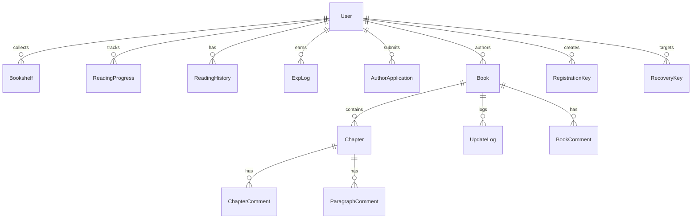

# 欲阅 · 数据库设计

| 字段 | 内容 |
|------|------|
| 文档类型 | 数据库设计（ER、表结构、约束、迁移策略） |
| 版本 | v1.0 |
| 最后更新 | 2026-07-03 |
| 数据来源 | `backend/app/models/*.py`（以代码为准） |

> 本文基于 ORM 模型逐表说明字段与约束，与 [欲阅需求分析.md](../欲阅需求分析.md) §10 对应但更详尽。字段类型以 SQLite 为准；枚举存 `String(20)` 小写值。

---

## 目录

1. [设计总览](#1-设计总览)
2. [ER 图](#2-er-图)
3. [表结构明细](#3-表结构明细)
4. [索引与约束](#4-索引与约束)
5. [建表与迁移策略](#5-建表与迁移策略)
6. [种子数据](#6-种子数据)

---

## 1. 设计总览

| 项 | 设计 |
|----|------|
| 数据库 | SQLite（`DATABASE_URL` 可配置；生产固定 `/var/lib/yuyue/yuyue.db`） |
| 建表方式 | `seed.init_db()` → `Base.metadata.create_all()` |
| 结构变更 | `database.run_schema_migrations()` 增量补丁（非 Alembic） |
| 时间存储 | 库内 UTC naive（`datetime_util.now_utc`）；接口返回东八区（`Asia/Shanghai`） |
| 枚举 | 小写字符串（`String(20)`），唯一来源 `core/constants.py` |
| 命名 | 表名复数 snake_case；外键 `{实体}_id`；时间 `_at`；布尔 `is_`/`has_` |
| 软删除 | 无；评论隐藏用 `is_hidden` 标记，书籍下架用 `status` + `admin_delisted` |

设计要点：

1. **评论分三表**（书评/章评/段评），避免一张宽表大量可空字段，便于按锚点建索引。
2. **进度表唯一约束** `(user_id, book_id)`，保证一本在读书只有一条当前进度。
3. **字数冗余**：`books.word_count` 冗余汇总章节字数，降低广场列表聚合成本；由 Service 在章节增删改后回写。
4. **一次性语义**：注册码/找回密钥用 `status`（unused/used/expired）保证原子消费；签到用 `(user_id, check_date)` 唯一保证每日一次。

## 2. ER 图



## 3. 表结构明细

### 3.1 `users` — 用户

| 字段 | 类型 | 约束/默认 | 说明 |
|------|------|-----------|------|
| id | INTEGER | PK, autoincrement | |
| nickname | VARCHAR(20) | UNIQUE, index | 昵称 |
| password_hash | VARCHAR(255) | NOT NULL | bcrypt 哈希 |
| avatar | VARCHAR(255) | 默认 `""` | 头像 URL |
| role | VARCHAR(20) | 默认 `user` | `guest/user/author/admin/superadmin` |
| status | VARCHAR(20) | 默认 `active` | `active/banned` |
| exp | INTEGER | 默认 0 | 累计经验 |
| reader_settings | TEXT | NULL | 阅读设置 JSON |
| created_at | DATETIME | server_default now | |
| updated_at | DATETIME | onupdate now | |

### 3.2 `registration_keys` — 注册码

| 字段 | 类型 | 约束/默认 | 说明 |
|------|------|-----------|------|
| id | INTEGER | PK | |
| code | VARCHAR(32) | UNIQUE, index | 注册码 |
| status | VARCHAR(20) | 默认 `unused` | `unused/used/expired` |
| created_by | INTEGER | FK users, NULL | 生成者 |
| used_by | INTEGER | FK users, NULL | 使用者 |
| expires_at | DATETIME | NULL | 过期时间 |
| used_at | DATETIME | NULL | 使用时间 |
| created_at | DATETIME | | |

### 3.3 `recovery_keys` — 找回密钥

| 字段 | 类型 | 约束/默认 | 说明 |
|------|------|-----------|------|
| id | INTEGER | PK | |
| code | VARCHAR(32) | UNIQUE, index | 密钥 |
| user_id | INTEGER | FK users | 目标账号 |
| status | VARCHAR(20) | 默认 `unused` | |
| created_by | INTEGER | FK users, NULL | 生成者（管理员） |
| expires_at | DATETIME | NULL | 默认生成 7 天有效 |
| used_at | DATETIME | NULL | |
| created_at | DATETIME | | |

### 3.4 `books` — 书籍

| 字段 | 类型 | 约束/默认 | 说明 |
|------|------|-----------|------|
| id | INTEGER | PK | |
| title | VARCHAR(100) | NOT NULL | 书名 |
| author_id | INTEGER | FK users | 作者 |
| description | TEXT | 默认 `""` | 简介 |
| cover | VARCHAR(255) | 默认 `""` | 封面 URL |
| category | VARCHAR(50) | 默认 `其他` | 见 `BOOK_CATEGORIES` |
| word_count | INTEGER | 默认 0 | 冗余总字数 |
| status | VARCHAR(20) | 默认 `published` | `draft/published/unpublished` |
| admin_delisted | BOOLEAN | 默认 False | 管理员强制下架标记 |
| created_at / updated_at | DATETIME | | |

### 3.5 `chapters` — 章节

| 字段 | 类型 | 约束/默认 | 说明 |
|------|------|-----------|------|
| id | INTEGER | PK | |
| book_id | INTEGER | FK books, index | 所属书 |
| title | VARCHAR(100) | NOT NULL | 章节标题 |
| content | TEXT | 默认 `""` | 正文（`\n\n` 分段，`[img:/uploads/...]` 图片块） |
| word_count | INTEGER | 默认 0 | 字数（去空白统计） |
| sort_order | INTEGER | 默认 0 | 排序（从 1 起） |
| created_at / updated_at | DATETIME | | |

### 3.6 `update_logs` — 更新日志

| 字段 | 类型 | 约束/默认 | 说明 |
|------|------|-----------|------|
| id | INTEGER | PK | |
| book_id | INTEGER | FK books, index | |
| chapter_id | INTEGER | FK chapters | |
| added_words | INTEGER | 默认 0 | 本次新增字数 |
| created_at | DATETIME | | |

写入规则：作品已发布且新增字数 > 0 时（发布、新增/编辑章节）记录；草稿不记录。

### 3.7 `book_comments` — 书评

| 字段 | 类型 | 约束/默认 | 说明 |
|------|------|-----------|------|
| id | INTEGER | PK | |
| book_id | INTEGER | FK books, index | |
| user_id | INTEGER | FK users | |
| content | TEXT | NOT NULL | 1–500 字 |
| parent_id | INTEGER | NULL | 父评论（仅支持一级回复） |
| is_pinned | BOOLEAN | 默认 False | 作者置顶 |
| is_hidden | BOOLEAN | 默认 False | 后台隐藏 |
| created_at | DATETIME | | |

### 3.8 `chapter_comments` — 章评

同书评结构，锚点为 `chapter_id`（FK chapters, index），无额外字段。

### 3.9 `paragraph_comments` — 段评

| 字段 | 类型 | 约束/默认 | 说明 |
|------|------|-----------|------|
| id | INTEGER | PK | |
| chapter_id | INTEGER | FK chapters, index | |
| paragraph_index | INTEGER | NOT NULL | 文本段索引（图片块不参与计数） |
| user_id | INTEGER | FK users | |
| content | TEXT | NOT NULL | |
| parent_id | INTEGER | NULL | |
| is_pinned | BOOLEAN | 默认 False | |
| is_hidden | BOOLEAN | 默认 False | |
| created_at | DATETIME | | |

### 3.10 `bookshelf` — 书架

| 字段 | 类型 | 约束/默认 | 说明 |
|------|------|-----------|------|
| user_id | INTEGER | FK users, **PK（联合）** | |
| book_id | INTEGER | FK books, **PK（联合）** | |
| created_at | DATETIME | | |

### 3.11 `reading_progress` — 阅读进度

| 字段 | 类型 | 约束/默认 | 说明 |
|------|------|-----------|------|
| id | INTEGER | PK | |
| user_id | INTEGER | FK users, index | |
| book_id | INTEGER | FK books, index | |
| chapter_id | INTEGER | FK chapters | |
| offset | FLOAT | 默认 0.0 | 0–1 滚动比例 |
| updated_at | DATETIME | onupdate now | 冲突以服务端为准 |

唯一约束：`uq_reading_progress_user_book`（user_id, book_id）。

### 3.12 `reading_history` — 阅读历史

| 字段 | 类型 | 约束/默认 | 说明 |
|------|------|-----------|------|
| id | INTEGER | PK | |
| user_id | INTEGER | FK users, index | |
| book_id | INTEGER | FK books, index | |
| chapter_id | INTEGER | FK chapters | |
| created_at | DATETIME | | |

每次进度上报追加一条；与进度表分离（进度回答「读到哪」，历史回答「读过什么」）。

### 3.13 `check_ins` — 签到

| 字段 | 类型 | 约束/默认 | 说明 |
|------|------|-----------|------|
| id | INTEGER | PK | |
| user_id | INTEGER | FK users, index | |
| fortune_text | VARCHAR(200) | 默认 `""` | 运势文案 |
| exp_gained | INTEGER | 默认 0 | 本次经验（随机 5–15） |
| check_date | DATE | NOT NULL | 签到日期 |
| created_at | DATETIME | | |

唯一约束：`uq_check_in_user_date`（user_id, check_date）。

### 3.14 `exp_logs` — 经验流水

| 字段 | 类型 | 约束/默认 | 说明 |
|------|------|-----------|------|
| id | INTEGER | PK | |
| user_id | INTEGER | FK users, index | |
| source | VARCHAR(50) | NOT NULL | `check_in/read/comment` |
| amount | INTEGER | NOT NULL | 本次经验 |
| created_at | DATETIME | | |

经验规则（`exp_service.py`）：

| 来源 | 单次 | 日上限 |
|------|------|--------|
| check_in（签到） | 5–15（随机） | 无（每日一次） |
| read（换章） | 2 | 20 |
| comment（发表评论） | 5 | 25 |

### 3.15 `author_applications` — 作者申请

| 字段 | 类型 | 约束/默认 | 说明 |
|------|------|-----------|------|
| id | INTEGER | PK | |
| user_id | INTEGER | FK users, index | |
| reason | TEXT | NOT NULL | 申请理由（10–500 字） |
| status | VARCHAR(20) | 默认 `pending` | `pending/approved/rejected` |
| review_note | TEXT | NULL | 审核备注 |
| reviewed_by | INTEGER | FK users, NULL | 审核人 |
| created_at | DATETIME | | |
| reviewed_at | DATETIME | NULL | |

## 4. 索引与约束

| 表 | 索引/约束 | 用途 |
|----|-----------|------|
| users | UNIQUE(nickname) + index | 昵称唯一、登录查找 |
| registration_keys / recovery_keys | UNIQUE(code) + index | 密钥唯一 |
| books / chapters | index(book_id) | 按书查章节 |
| update_logs | index(book_id) | 书主页更新日志 |
| 三评论表 | index(book_id / chapter_id) | 按锚点查列表 |
| bookshelf | PK(user_id, book_id) | 收藏唯一 |
| reading_progress | UNIQUE(user_id, book_id) + index(user_id), index(book_id) | 一人在读书一条进度 |
| reading_history | index(user_id) | 历史列表 |
| check_ins | UNIQUE(user_id, check_date) + index(user_id) | 每日一次 |
| exp_logs | index(user_id) | 经验流水 |

## 5. 建表与迁移策略

### 5.1 初始化

```python
# backend/app/seed.py
def init_db() -> None:
    Base.metadata.create_all(bind=engine)   # 按模型建表
    run_schema_migrations(engine)           # 增量补丁
    if 有用户 or 未开启 SEED_ON_STARTUP: return
    _seed(db)                               # 写入演示数据
```

应用启动时（`main.py` lifespan）自动调用 `init_db()`。

### 5.2 增量迁移

`database.run_schema_migrations()`：

1. 建 `schema_migrations` 版本表（`id=1, version`）；
2. 对已有库做增量列补丁（当前版本 v1）：
   - `users` 缺 `reader_settings` → `ALTER TABLE users ADD COLUMN reader_settings TEXT`
   - `books` 缺 `admin_delisted` → `ALTER TABLE books ADD COLUMN admin_delisted BOOLEAN DEFAULT 0`

> 新增列时在此函数追加补丁并升级版本号；未来如需复杂迁移可启用 Alembic（已列入依赖）。

### 5.3 重置与修复

| 命令（backend 目录） | 行为 | 生产限制 |
|----------------------|------|----------|
| `python -m app.seed_test` | `reset_db()`：drop_all → create_all → 填充演示数据 | `ENVIRONMENT=production` 时拒绝执行 |
| `python -m app.seed_repair` | `repair_chapter_content()`：规范化存量 `[img:...]` marker、重算字数 | 无（维护工具） |

## 6. 种子数据

`app/seed.py` 写入内容（`SEED_ON_STARTUP=true` 或 `app.seed_test`）：

| 数据 | 内容 |
|------|------|
| 账号 | superadmin/super123、admin/admin123、reader/test123、晚风读者/123456、applicant、banned、作者林暮及沈砚/顾遥等 8 位（test123） |
| 注册码 | `YUYUE-DEMO-2026`、`YUYUE-TEST-READ`（永久）、`YUYUE-TEST-EXP`（30 天） |
| 书籍 | 9 本已发布短篇 + 林暮 1 本草稿《灯下草稿》 |
| 评论 | 章评/段评/书评若干（含置顶） |
| 其他 | 书架、阅读进度、签到、经验流水、待审核作者申请 |

校验工具：`backend/scripts/verify_seed.py`（统计表数量、登录用例、广场总数、章节段落数、注册码校验）。

---

*文档结束 · 欲阅 05-数据库设计 v1.0*
