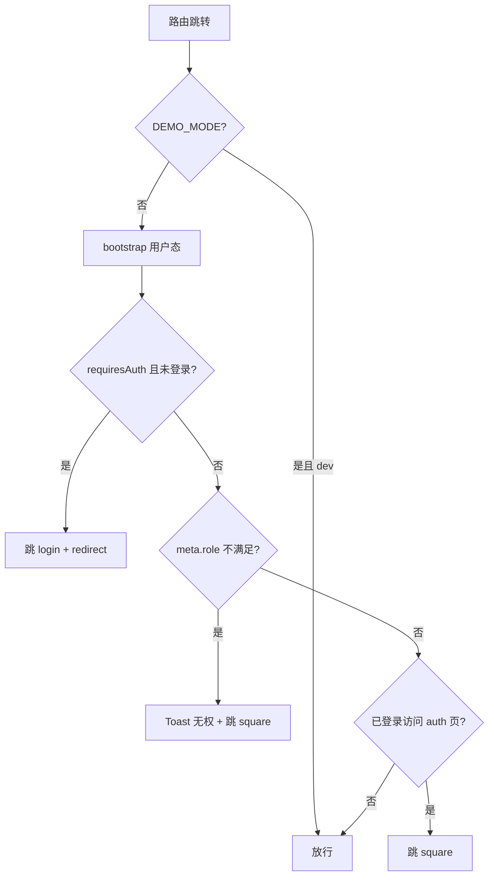

# 欲阅 · 前端实现

| 字段 | 内容 |
|------|------|
| 文档类型 | 前端实现说明（路由、分层、状态、阅读器、组件、样式） |
| 版本 | v1.0 |
| 最后更新 | 2026-07-03 |
| 数据来源 | `frontend/src/**` 代码（以代码为准） |

> 本文说明前端是怎么实现的。接口对应见 [08-API 接口文档.md](./08-API接口文档.md)，命名约束见 [04-命名与实现规范.md](./04-命名与实现规范.md)。

---

## 目录

1. [技术栈与构建](#1-技术栈与构建)
2. [应用启动与布局](#2-应用启动与布局)
3. [路由与守卫](#3-路由与守卫)
4. [HTTP 层](#4-http-层)
5. [状态管理（Pinia）](#5-状态管理pinia)
6. [API 模块](#6-api-模块)
7. [Composables 复用逻辑](#7-composables-复用逻辑)
8. [阅读页实现](#8-阅读页实现)
9. [页面与组件](#9-页面与组件)
10. [样式体系](#10-样式体系)

---

## 1. 技术栈与构建

| 项 | 值 |
|----|----|
| 框架 | Vue 3.5（Composition API）+ TypeScript 5.6（strict） |
| 构建 | Vite 6；`npm run build` = `vue-tsc -b && vite build`（先类型检查） |
| 依赖 | `vue`、`vue-router@4`、`pinia@2`、`axios@1.7`、`@phosphor-icons/vue@2` |
| 测试 | Vitest 3（node 环境，`src/**/*.test.ts`） |
| 别名 | `@ → src` |
| dev 代理 | `/api`、`/uploads` → `http://127.0.0.1:8000` |
| 环境变量 | `VITE_API_BASE_URL=/api/v1`；`VITE_DEMO_MODE`（仅 dev 生效的守卫直通开关，默认 false） |

`index.html`：`lang=zh-CN`，viewport 含 `viewport-fit=cover`（刘海屏适配）。

## 2. 应用启动与布局

`main.ts` 启动顺序：

1. `setupProgressQueueSync()`（注册 `online` 事件补发进度队列）；
2. 创建 app；`app.config.errorHandler` 记录错误；
3. pinia → router；
4. `getDeviceSnapshot()` 初始化 device store；
5. **`userStore.bootstrap()` 完成后才 `app.mount('#app')`**（避免闪现未登录态；bootstrap 内部用 refresh token 换新并拉取用户与云端阅读设置）。

布局（`layouts/`）：

| 布局 | 用于 | 说明 |
|------|------|------|
| `DefaultLayout.vue` | 业务页（广场/书/书架/个人中心等） | 顶栏 Header + 主区 + 移动端底部 TabBar |
| `AuthLayout.vue` | 登录/注册/找回 | 左视觉右表单双栏（≥900px） |
| `AdminLayout.vue` | 管理后台 | 深色侧栏 + 顶栏 + 主区 |
| 无（全屏） | 阅读页 `ReaderView` | 自身 toolbar，不挂公共布局；`/` 导航页独立 |

## 3. 路由与守卫

路由表（`router/index.ts`，全部懒加载）：`/`（landing）、`/auth/login|register|recover`、DefaultLayout 下 `/square`、`/book/:bookId`、`/shelf`、`/profile*`（edit/password/exp/titles/history/apply-author/works/works/:bookId/chapters）、全屏 `/read/:bookId/:chapterId`、AdminLayout 下 `/admin*`（默认重定向到 applications）。

守卫（`router/guards.ts`）顺序：

角色比较用 `ROLE_LEVEL = {guest:0, user:1, author:2, admin:3, superadmin:4}` 数值等级；`meta.role` 取 `to.matched` 最后一个。

## 4. HTTP 层

`api/http.ts`（axios 实例，baseURL `/api/v1`，timeout 15s）：

- **请求拦截**：附加 `Authorization: Bearer <access>`；`config.data` / `config.params` 递归 `keysToSnake`。
- **响应成功**：递归 `keysToCamel`；`code !== 0` 视为业务失败 reject 为 `AppError`。
- **响应失败**（核心：40101 刷新重放）：
  1. 归一化为 `AppError`（超时/断网 → `-1`；有响应体按 code；否则按 HTTP 状态映射）；
  2. `isTokenExpired`（40101）且未 `_retry` → **单飞刷新**（`isRefreshing` 互斥 + `refreshQueue` 挂起并发请求）；用裸 axios POST `/auth/refresh`；成功 → `setTokens` + 重放原请求；失败 → `invalidateSession()`（清会话跳登录）并 reject。

`api/request.ts`：类型安全薄封装，返回解包后的 `data`；失败抛 `AppError`。所有 api 模块只依赖 `request`（`upload.ts` 因 FormData 直接用 `http`）。

## 5. 状态管理（Pinia）

| Store | 内容 | 持久化 |
|-------|------|--------|
| `user` | `token`、`userInfo`、`bootstrapped`；`setAuth` / `logout` / `bootstrap` | localStorage（`utils/token.ts`：`yuyue_access_token` / `yuyue_refresh_token`） |
| `device` | `deviceType`（desktop/android/ios） | sessionStorage 无；由 `useDevice`/`getDeviceSnapshot` 写入 |

`userStore.bootstrap()`：无 token 有 refresh → 刷新换新；有 token → `fetchCurrentUser()`；认证类失败（401/40101/40301）→ 清会话。登录成功（`setAuth`）与 bootstrap 都会触发 `pullReaderSettingsFromCloud()`（云端阅读设置覆盖本地）。

## 6. API 模块

`api/*.ts` 共 13 个模块、约 60 个函数，端点与后端一一对应（完整清单见 [08-API 接口文档.md](./08-API接口文档.md)）：

| 模块 | 覆盖 |
|------|------|
| `auth.ts` | 登录/注册/校验注册码/刷新/找回/登出 |
| `users.ts` | 当前用户/改资料/改密 |
| `books.ts` | 分类/列表/详情/更新日志/书评/章节正文 |
| `comments.ts` | 段评/章评/书评树、删除、置顶 |
| `bookshelf.ts` | 书架增删查 |
| `reading.ts` | 进度读写、历史 |
| `profile.ts` | 签到、经验、头衔、作者申请、阅读设置 |
| `author.ts` | 作品与章节 CRUD、发布下架、排序 |
| `upload.ts` | 图片上传（返回完整 URL / 相对路径两种） |
| `admin.ts` | 用户/密钥/书籍/申请/评论/章节治理 |
| `http.ts` / `request.ts` | 基础设施 |

## 7. Composables 复用逻辑

| Composable | 职责 | 关键点 |
|------------|------|--------|
| `useApiAction` | 带 loading 的请求封装 | `run(fn, {silent, message, onError, rethrow})` |
| `useBookComments` | 书评树加载/发表/删除/置顶 | 书详情页使用 |
| `useChapterComments` | 章评 + 整章段评缓存 | `Promise.all` 并发拉取；`loadToken` 自增令牌丢弃过期响应（快速切章竞态） |
| `useDevice` | UA 识别 + resize | `MOBILE_BREAKPOINT=768`；`getDeviceSnapshot()` 同步读取供启动 |
| `useParagraphTap` | 双击/双触打开段评 | `TAP_INTERVAL_MS=350`、位移阈值 12px 区分滑动 |
| `useProgressQueue` | 进度离线队列 | localStorage `yuyue_progress_queue`；`online` 事件补发 |
| `useReaderProgress` | 进度计算与节流上报 | 3s 节流；切章/卸载强制 flush；失败入队列；`restoreScroll`/`restorePageIndex` |
| `useReaderPagination` | 翻页分页（DOM 实测） | 隐藏测量 div；长段二分切分；图片 70%vh 上限；`ResizeObserver` 重算 |
| `useReaderScrollChain` | 滚动连续读下一章 | 32% 视口标记线定位当前章；`loadGeneration` 代际防竞态 |
| `useReaderSettings` | 阅读设置模型 | 白名单校验 + 范围钳制；localStorage `yuyue_reader_settings` |
| `useReaderSettingsSync` | 设置云同步 | 登录拉取覆盖本地；800ms 防抖上传 |
| `useScrollLock` | 浮层背景滚动锁 | body `position:fixed` + 恢复 scrollY |

**竞态防护模式**：`loadReaderSeq`（阅读页加载）、`loadToken`（评论加载）、`loadGeneration`（滚动链续章）三套自增令牌。

## 8. 阅读页实现

`views/reader/ReaderView.vue`（全项目最复杂页面，约 1800 行）与 `components/reader/*` 协作。

### 8.1 双阅读模式

| 模式 | 判定 | 实现 |
|------|------|------|
| 滚动模式 | 桌面端，或移动端 `pageMode=scroll` | `useReaderScrollChain` 渲染多章 sections；滚至章末自动预载下一章 |
| 翻页模式 | 移动端且 `pageMode=slide` | `useReaderPagination` DOM 实测分页；左右热区/触摸滑动/方向键翻页 |

PC 固定滚动（`isPageMode = !isDesktop && settings.pageMode !== 'scroll'`）。

### 8.2 正文块渲染

| 组件 | 职责 |
|------|------|
| `ReaderChapterContent` | 按 blocks 渲染文本/图片块，转发段评手势事件 |
| `ReaderPageContent` | 翻页切片渲染（含章评卡片切片），图片加载后触发重算 |
| `ReaderParagraph` | 段落渲染；`content-visibility:auto` 性能优化；段评角标 |
| `ReaderImageBlock` | 图片渲染（`resolveMediaUrl` 解析、`max-height: min(70vh, 520px)`、懒加载） |

### 8.3 作者编辑模式

`book.authorId === 当前用户` 时顶栏出现「编辑正文」：

- `AuthorChapterContentEditor`：块级编辑视图（隐藏段评角标）。
- `AuthorBlockInsertBar`：每段下方「+ 插入图片」常驻条（移动端无需 hover）。
- `AuthorImageBlockChrome`：图片编辑外框（替换/删除）。
- 保存：上传图片 → 写入 `[img:/uploads/...]` marker → `PATCH /author/chapters/{id}` → 局部更新滚动链/缓存并重算分页。

章节管理页与后台章节编辑弹窗复用同一套编辑器组件。

### 8.4 评论侧栏与章评

- 段评：`useParagraphTap` 双击/双触 → 侧栏（`useScrollLock` 锁背景）→ 列表/回复/删除/置顶。
- 章评：章末 `ReaderChapterCommentCard`（精选置顶或回复最多）→ 侧栏详情。
- 滚动链章节变化时对每节 `prefetchComments` 预取缓存。
- `?focus=chapter-comment` query 支持从作品管理直达章评输入。

### 8.5 顶栏与二级面板

- 顶栏：点击正文切换显隐，3s 无操作自动隐藏。
- 二级面板：目录 / 进度 / 设置三个 Tab；移动端底部弹出、桌面端右侧抽屉。

## 9. 页面与组件

### 9.1 主要页面

| 页面 | 功能 |
|------|------|
| `LandingView` | 品牌落地；登录/注册 CTA；推荐书「书堆」装饰 |
| `LoginView` / `RegisterView` / `RecoverView` | 认证三页；注册两步（注册码校验 → 资料）；登录后 `safeRedirectPath` 回跳 |
| `SquareView` | 广场：搜索防抖 300ms、分类 chips、排序、加载更多分页（每页 12） |
| `BookDetailView` | 书主页：详情 + 书架切换 + 简介展开 + 更新日志 + 书评 `CommentDock(side)` |
| `ShelfView` | 书架网格：进度条；点击直达阅读；长按 550ms 移除 |
| `ProfileView` | 个人中心：签到/运势/头衔进度；菜单按角色动态 |
| `AuthorApplyView` / `WorksManageView` / `ChapterManageView` | 作者申请、作品管理（发布/下架/置顶评入口）、章节管理（拖拽排序 + 双栏块编辑器） |
| `EditProfileView` / `ChangePasswordView` / `ExpLogView` / `HistoryView` / `TitleGuideView` | 资料、改密、经验流水、历史、头衔图鉴 |
| admin 六页 | 用户（封禁/角色）、密钥（批量生成/CSV 导出/找回密钥）、作品（上下架/删除）、章节编辑、申请审核、评论治理 |

### 9.2 通用组件（`components/common/`）

`AppHeader`、`AppTabBar`、`AppToast`（注入 `notify`）、`BookCard`、`EmptyState`、`ErrorBoundary`、`ExpProgressBar`、`SubPageHeader`、`SubPageShell`、`TitleBadge`（头衔徽章）、`UserAvatar`。

### 9.3 评论组件（`components/comment/`）

- `CommentDock`：通用评论容器（side/inline 两种模式），列表独立滚动 + 底部固定发表区。
- `CommentItem`（`CommentItemRow`）：头像 + 头衔徽章 + 置顶/作者徽标；按权限显示回复/删除/置顶；递归渲染一级回复。
- `commentTypes.ts`：Props 类型定义。

## 10. 样式体系

| 文件 | 职责 |
|------|------|
| `variables.css` | 设计变量：冷纸/深墨/酒红（`--color-accent:#8b2942`）色板、阴影、圆角、字体（Noto Sans/Serif SC）、字号/间距阶梯、布局变量（`--reader-max-width:720px` 等）、`prefers-color-scheme: dark` 暗色模式 |
| `reset.css` | 盒模型归一、页面过渡动画、`:focus-visible` 焦点样式 |
| `components.css` | 全局组件类：`.btn`（胶囊按钮变体）、`.field` 表单、`.tag`、`.card`、`.page-container` |
| `admin.css` | 后台专属：`.admin-table`（sticky 表头）、`.status-tag`（状态三色）、密钥横幅等 |

断点约定（分散在各组件）：

| 断点 | 布局 |
|------|------|
| 768px | TabBar/顶栏切换；阅读面板底部 Sheet ↔ 右侧抽屉 |
| 900px | 认证双栏、书主页书评侧栏 |
| 640px | 落地页欢迎语等细节 |

---

*文档结束 · 欲阅 07-前端实现 v1.0*
