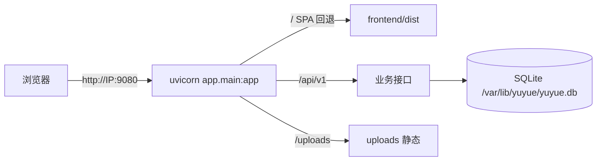

# 欲阅 · 部署与运维

| 字段 | 内容 |
|------|------|
| 文档类型 | 部署与运维（安装、启动、停止、状态、目录约定、常见问题） |
| 版本 | v1.0 |
| 最后更新 | 2026-07-03 |
| 适用范围 | Ubuntu 20.04 / 22.04 / 24.04 |

> 快速上手见根目录 [README.md](../README.md#ubuntu-生产部署)。本文补充脚本细节、目录约定与运维要点。

---

## 目录

1. [部署形态](#1-部署形态)
2. [目录与端口约定](#2-目录与端口约定)
3. [安装脚本 install.sh](#3-安装脚本-installsh)
4. [日常运维脚本](#4-日常运维脚本)
5. [systemd 服务](#5-systemd-服务)
6. [环境变量](#6-环境变量)
7. [数据库与数据维护](#7-数据库与数据维护)
8. [常见问题排查](#8-常见问题排查)

---

## 1. 部署形态

**单端口模式，无 Nginx**：FastAPI 进程同时提供前端静态资源（`FRONTEND_DIST`）、`/api/v1` 与 `/uploads`。公网直接访问 `http://<IP>:<端口>`（默认 9080）。



`deploy/nginx/` 目前为空目录（预留反向代理方案）；`deploy/systemd/yuyue-backend.service.template` 是服务模板。

## 2. 目录与端口约定

| 路径 | 内容 |
|------|------|
| `<项目根>/backend/.env` | 生产配置（`PORT`、`HOST`、`SECRET_KEY`、`DATABASE_URL` 等） |
| `<项目根>/frontend/dist/` | 前端构建产物 |
| `/var/lib/yuyue/` | SQLite（`yuyue.db`）+ 上传文件（`uploads/`） |
| `/var/log/yuyue/` | `backend.log`、`backend-error.log`（systemd 追加写入） |
| `<项目根>/run/` | 运行目录（chmod 755） |
| `/etc/systemd/system/yuyue.service` | 渲染后的 systemd 单元 |

端口约定：默认 **9080**（刻意避开常见的 80 / 8000）；`scripts/install.sh --port <n>` 可自定义。

## 3. 安装脚本 install.sh

**用法：**

```bash
sudo bash scripts/install.sh [--with-seed] [--port 9080]
```

**参数：**

| 参数 | 说明 |
|------|------|
| `--with-seed` | 安装后写入演示测试数据（仅建议首次部署） |
| `--port <port>` | 服务端口（默认 9080） |
| `-h / --help` | 打印用法 |

**流程（幂等，可重复执行）：**

1. **CRLF 修复**：检测 `lib/common.sh` 含 `\r` 时对 `scripts/*.sh` 统一 `sed -i 's/\r$//'`（WinSCP/Windows 上传保护）。
2. **参数解析**（`--with-seed` / `--port` / help；未知参数报错退出）。
3. **前置校验**：`require_ubuntu`（仅 Ubuntu）；必须 root（`EUID==0`）。
4. **系统依赖**：`apt-get update` + 安装 `python3 python3-venv python3-pip curl openssl ca-certificates ufw lsb-release`。
5. **Node.js**：`node` 缺失或主版本 < 18 时经 nodesource 安装 **Node.js 20 LTS**。
6. **目录**：创建 `/var/lib/yuyue/{uploads}`、`/var/log/yuyue`、`run/`，属主改为部署用户（`$SUDO_USER`）。
7. **虚拟环境**：创建 `backend/.venv`，`pip install -r backend/requirements.txt`。
8. **生成 backend/.env**（已存在则跳过并警告）：
   - `SECRET_KEY="$(openssl rand -hex 32)"`；
   - `ENVIRONMENT=production`、`SEED_ON_STARTUP=false`、`DATABASE_URL=sqlite:////var/lib/yuyue/yuyue.db`、`UPLOAD_DIR=/var/lib/yuyue/uploads`；
   - `HOST=0.0.0.0`、`PORT=<端口>`、`FRONTEND_DIST=<root>/frontend/dist`；
   - `CORS_ORIGINS=["http://<公网IP>:<端口>","http://127.0.0.1:<端口>","http://localhost:<端口>"]`；
   - 文件 `chmod 600`、属主为部署用户。
9. **构建前端**：`cd frontend && npm ci && npm run build`。
10. **初始化表结构**：`python -c 'from app.seed import init_db; init_db()'`。
11. **可选种子**：`--with-seed` 时以 `ENVIRONMENT=development` 执行 `python -m app.seed_test`。
12. **systemd**：渲染模板到 `/etc/systemd/system/yuyue.service`；`daemon-reload`；`enable`。
13. **防火墙 ufw**：未启用则启用；放行 OpenSSH 与 `${PORT}/tcp`。
14. **启动**：`systemctl restart yuyue`。
15. **摘要输出**：访问地址、`/health`、`/docs`、数据/日志目录、服务管理命令、测试账号（--with-seed 时）。

**改端口**：手动编辑 `backend/.env` 的 `PORT=` 后重跑 install，或直接改 systemd 单元并 `daemon-reload && restart`。

## 4. 日常运维脚本

| 脚本 | 行为 |
|------|------|
| `bash scripts/start.sh` | `systemctl start yuyue`，输出访问地址 |
| `bash scripts/stop.sh` | `systemctl stop yuyue`（失败不报错） |
| `bash scripts/status.sh` | ① systemd 状态（前 14 行）② `ss` 端口监听检查 ③ `curl /health` 健康检查 ④ `curl /` 前端可达性 ⑤ 公网地址 |
| `bash scripts/init_db.sh` | 开发环境：建 venv → 装依赖 → 复制 `.env.example` → `init_db()` |

> 脚本仅支持 Ubuntu；`.gitattributes` 强制 `*.sh` 用 LF，install.sh 还会自动清理 CRLF（双保险）。

## 5. systemd 服务

渲染自 `deploy/systemd/yuyue-backend.service.template`（占位符：`__YUYUE_ROOT__`、`__YUYUE_USER__`、`__YUYUE_PORT__`）：

| 配置 | 值 | 说明 |
|------|----|------|
| Type | `simple` | uvicorn 前台常驻 |
| User/Group | 部署用户（非 root） | 安全加固 |
| WorkingDirectory | `<root>/backend` | |
| ExecStart | `<root>/backend/.venv/bin/uvicorn app.main:app --host 0.0.0.0 --port <端口> --workers 1` | 单 worker |
| Restart | `on-failure` + `RestartSec=5` | 自动拉起 |
| StandardOutput/Error | `append:/var/log/yuyue/backend[-error].log` | 日志落盘 |
| NoNewPrivileges | `true` | 禁止提权 |

**常用命令：**

```bash
sudo systemctl status yuyue        # 状态
sudo systemctl restart yuyue       # 重启
sudo journalctl -u yuyue -f        # 实时日志
tail -f /var/log/yuyue/backend.log # 应用日志
```

> 日志轮转：模板未内置 logrotate 指令，可自行在 `/etc/logrotate.d/` 添加 `/var/log/yuyue/*.log` 的轮转配置。

## 6. 环境变量

### 6.1 后端（`backend/.env`）

| 变量 | 示例（生产） | 说明 |
|------|--------------|------|
| `DATABASE_URL` | `sqlite:////var/lib/yuyue/yuyue.db` | 数据库连接串 |
| `SECRET_KEY` | 随机 hex（openssl rand -hex 32） | JWT 密钥；生产弱密钥拒绝启动 |
| `ENVIRONMENT` | `production` | 生产关闭 /docs、禁 reset_db |
| `SEED_ON_STARTUP` | `false` | 启动写种子开关 |
| `ACCESS_TOKEN_EXPIRE_MINUTES` | `120` | Access 有效期 |
| `REFRESH_TOKEN_EXPIRE_DAYS` | `7` | Refresh 有效期 |
| `UPLOAD_DIR` | `/var/lib/yuyue/uploads` | 上传目录 |
| `MAX_UPLOAD_MB` | `2` | 单文件上限 |
| `HOST` / `PORT` | `0.0.0.0` / `9080` | 监听地址 |
| `FRONTEND_DIST` | `<root>/frontend/dist` | 前端构建目录 |
| `CORS_ORIGINS` | `["http://IP:9080", ...]` | CORS 白名单 |

### 6.2 前端（`frontend/.env.*`，开发与生产一致）

| 变量 | 值 | 说明 |
|------|----|------|
| `VITE_API_BASE_URL` | `/api/v1` | API 基础路径（同源单端口） |
| `VITE_DEMO_MODE` | `false` | 演示模式（仅 dev 生效的守卫直通） |

## 7. 数据库与数据维护

| 操作 | 命令（backend 目录） | 说明 |
|------|---------------------|------|
| 重置演示数据 | `python -m app.seed_test` | drop_all → create_all → 种子；**生产拒绝** |
| 修复正文 | `python -m app.seed_repair` | 规范化 `[img:...]` marker 并重算字数 |
| 校验数据 | `python scripts/verify_seed.py` | 统计 + 登录用例 + 接口抽查 |

**备份：** 停服或低峰期复制 `/var/lib/yuyue/yuyue.db` 与 `uploads/` 即可（SQLite 单文件）。

## 8. 常见问题排查

| 现象 | 排查 |
|------|------|
| `$'\r': command not found` | 脚本 CRLF 问题：`sed -i 's/\r$//' scripts/*.sh scripts/lib/*.sh` |
| 启动即退出（生产） | 检查 `SECRET_KEY` 是否弱密钥（config.py 会 raise）；`journalctl -u yuyue -n 50` |
| 前端 404 / 白屏 | 检查 `FRONTEND_DIST` 指向与 `frontend/dist` 是否构建成功；`curl /` 应返回 index.html |
| 上传失败 | 检查 `/var/lib/yuyue/uploads` 属主是否为服务用户；文件大小是否超 `MAX_UPLOAD_MB` |
| 端口被占 | `ss -tlnp | grep <port>`；改 `backend/.env` 的 `PORT=` 并重启 |
| 健康检查失败 | `curl http://127.0.0.1:<port>/health`；检查数据库文件权限 |
| 测试跑不起来 | `requirements.txt` 不含 pytest/httpx，测试环境需另行安装：`pip install pytest httpx` |
| 云端阅读设置未同步 | 检查登录态；`GET/PUT /profile/reader-settings` 依赖 `users.reader_settings` 列（迁移 v1 已补） |

---

*文档结束 · 欲阅 09-部署与运维 v1.0*
