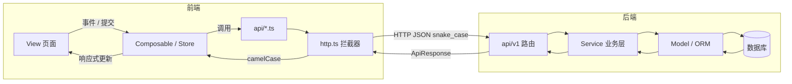
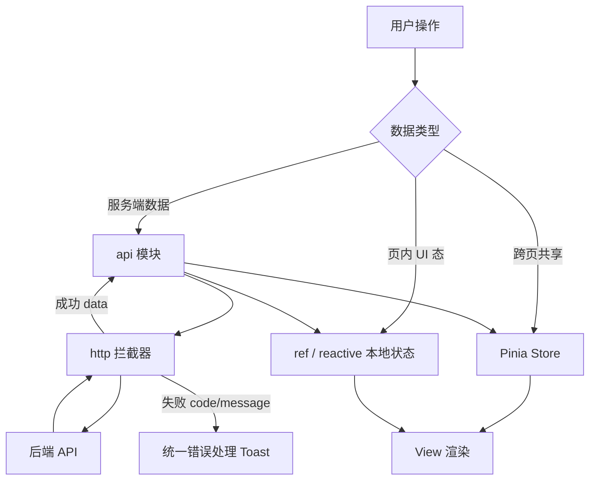
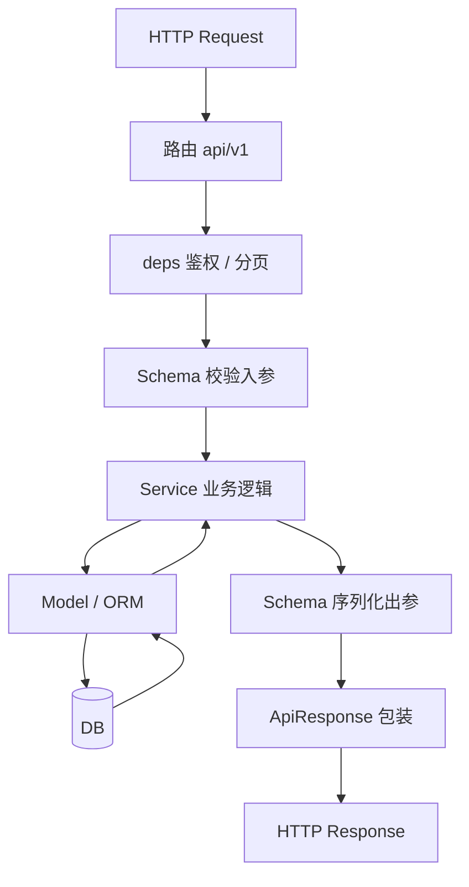
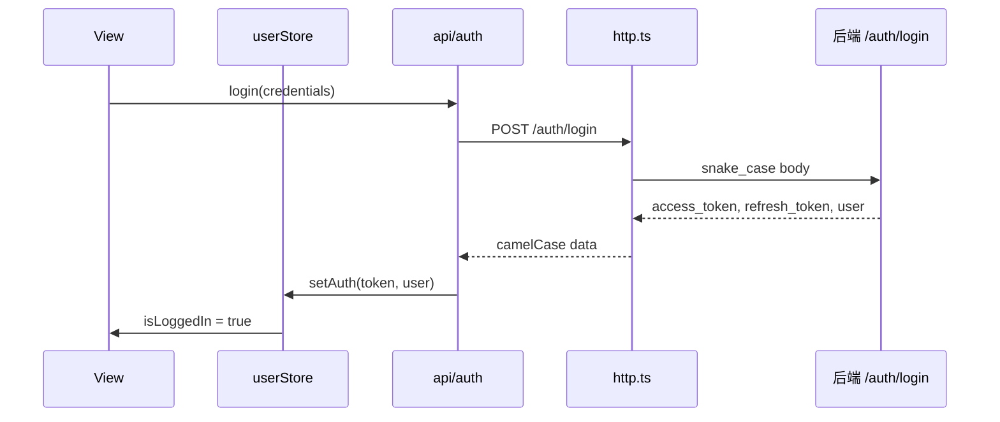
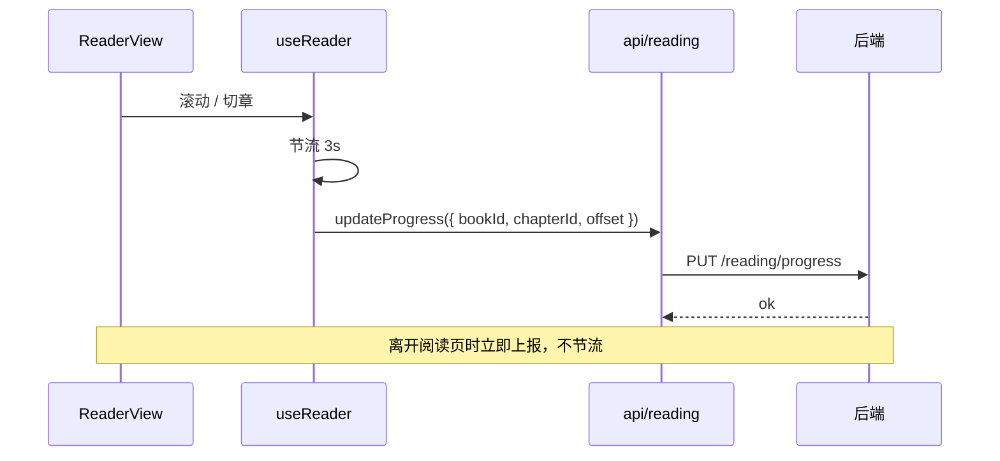
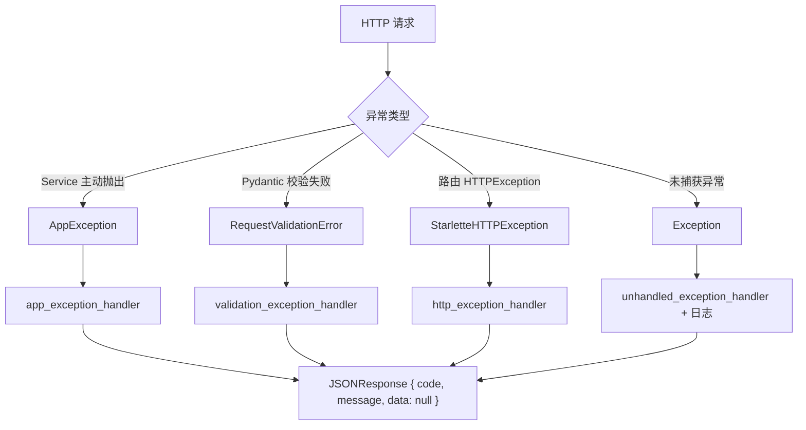
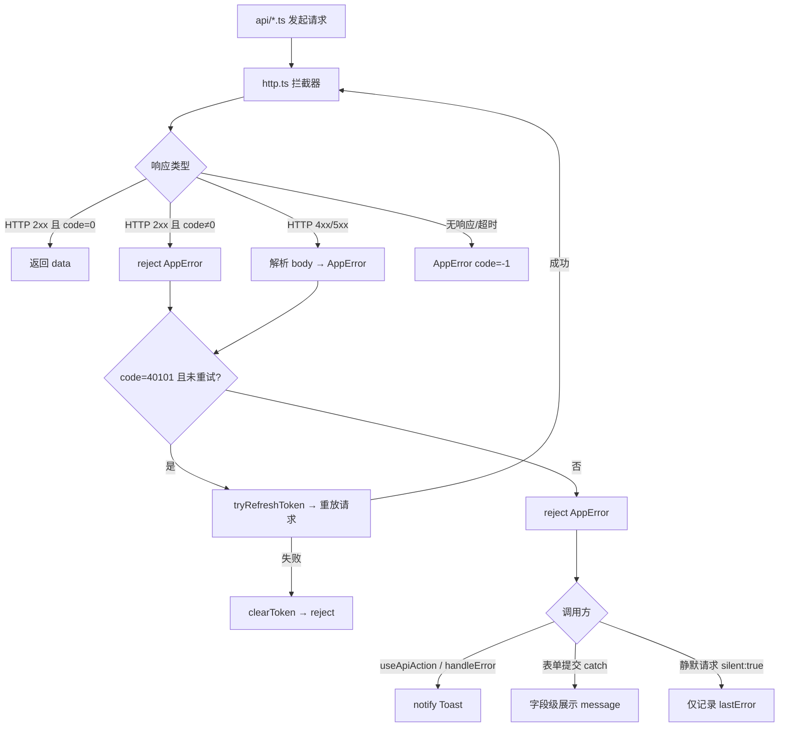

# 欲阅 · 项目规范

| 字段 | 内容 |
|------|------|
| 文档类型 | 开发约束（命名 / 数据流 / 文档规范） |
| 版本 | v1.4 |
| 最后更新 | 2026-07-03 |
| 适用范围 | 文档、后端、前端 |
| 优先级 | **高于个人习惯**；冲突时以本文为准 |

> 需求细节见 [欲阅需求分析.md](../欲阅需求分析.md)。本文规定「怎么写」与「怎么流转」，不重复业务描述。

---

## 目录

1. [文档规范](#1-文档规范)
2. [命名规范](#2-命名规范)
3. [数据流规范](#3-数据流规范)（含 [§3.8 异常处理](#38-异常处理流程)）
4. [分层职责](#4-分层职责)
5. [变更与审查](#5-变更与审查)

---

## 1. 文档规范

### 1.1 文档体系

| 文件 | 职责 | 维护时机 |
|------|------|----------|
| `欲阅需求分析.md` | 产品需求、页面规格、API 清单、库表设计 | 功能变更、接口变更、表结构变更 |
| `docs/CONVENTIONS.md` | 命名、数据流、文档写法（本文） | 规范本身调整时 |
| `README.md` | 项目入口、快速启动 | 目录或启动方式变更 |
| `backend/README.md` | 后端开发说明 | 后端结构或命令变更 |
| `frontend/README.md` | 前端开发说明 | 前端结构或命令变更 |
| `docs/README.md` | 文档索引 | 新增文档时 |

**原则：** 业务写需求分析，约束写 CONVENTIONS，操作写 README；三者不互相重复大段内容，用链接引用。

### 1.2 文档元信息

每份主文档文首必须包含表格化元信息：

```markdown
| 字段 | 内容 |
|------|------|
| 文档类型 / 项目名称 | … |
| 版本 | vX.Y |
| 最后更新 | YYYY-MM-DD |
```

版本号规则：

| 变更类型 | 版本 |
|----------|------|
| 错别字、格式 | 不变 |
| 补充说明、小修 | 修订位 +0.1 |
| 新增模块、接口、表 | 次位 +1.0 |

### 1.3 章节与排版

| 规则 | 说明 |
|------|------|
| 章节编号 | 一级 `## 1.`；二级 `### 1.1`；最多四级 |
| 流程描述 | 必须用 Mermaid（`flowchart` / `sequenceDiagram`） |
| 规格描述 | 必须用表格（字段、类型、权限、交互） |
| 代码标识符 | 英文；用户可见文案用中文 |
| 术语 | 首次出现可附英文标识；全文术语与 [需求分析附录 A](../欲阅需求分析.md#附录-a术语表) 一致 |
| 路径引用 | 使用反引号包裹，如 `backend/app/api/v1/auth.py` |
| 禁止 | 同一件事在多篇文档中复制粘贴维护；应单点维护 + 链接 |

### 1.4 需求分析文档专用结构

`欲阅需求分析.md` 章节顺序固定，新增内容归入对应章，不随意插章：

```
概述 → 架构 → 目录 → 权限 → 路由 → 流程 → 页面 → 评论
→ API → 数据库 → 状态 → UA → 后台 → 非功能 → 版本 → 附录
```

接口、表结构、路由变更时，**必须同步更新**需求分析对应章节，并在元信息中更新版本与日期。

---

## 2. 命名规范

### 2.1 总原则

| 层级 | 风格 | 示例 |
|------|------|------|
| 数据库 | `snake_case`，表名复数 | `users`, `reading_progress` |
| API 路径 | `kebab-case`，复数资源 | `/api/v1/books`, `/update-logs` |
| API JSON 载荷 | `snake_case` | `book_id`, `access_token` |
| Python 代码 | `snake_case`；类 `PascalCase` | `book_service.py`, `UserRole` |
| TypeScript 逻辑 | `camelCase`；类型 `PascalCase` | `bookId`, `UserInfo` |
| Vue 组件文件 | `PascalCase.vue` | `BookCard.vue`, `ReaderView.vue` |
| 路由 path | `kebab-case` | `/profile/apply-author` |
| 路由 name | `kebab-case` 或 `camelCase` | 项目内统一用 `kebab-case`：`profile-edit` |
| 常量 | `UPPER_SNAKE_CASE` | `MAX_PAGE_SIZE` |
| 枚举值（存库 / 接口） | `snake_case` 小写字符串 | `user`, `published` |
| 环境变量 | `UPPER_SNAKE_CASE` | `DATABASE_URL` |
| Git 分支 | `kebab-case` | `feat/reader-settings` |

### 2.2 前后端字段映射

**边界规则：** 网络传输与持久化一律 `snake_case`；前端业务代码一律 `camelCase`。转换仅在 API 层发生。

```
数据库 snake_case ←→ API JSON snake_case ←→ [转换层] ←→ 前端 camelCase
```

| 数据库 / API | 前端 |
|--------------|------|
| `book_id` | `bookId` |
| `chapter_id` | `chapterId` |
| `created_at` | `createdAt` |
| `word_count` | `wordCount` |
| `is_pinned` | `isPinned` |
| `access_token` | `accessToken` |

实现位置：

- 前端：`frontend/src/api/http.ts` 响应拦截器统一转 `camelCase`；请求拦截器统一转 `snake_case`
- 后端：Pydantic `alias` 或默认 `snake_case`，不做 camelCase

### 2.3 资源 ID 与路由参数

| 场景 | 命名 | 示例 |
|------|------|------|
| URL 路径参数 | `{id}` 或语义化 `{book_id}` | `/books/{book_id}/chapters` |
| 前端路由 params | `camelCase` 读取 | `route.params.bookId` |
| 外键字段 | `{实体}_id` | `user_id`, `author_id` |
| 布尔字段 | `is_` / `has_` 前缀 | `is_pinned`, `has_checked_in` |
| 时间字段 | `_at` 后缀 | `created_at`, `updated_at`, `used_at` |

### 2.4 文件与模块命名

#### 后端 `backend/app/`

| 类型 | 规则 | 示例 |
|------|------|------|
| 模型 | `models/{单数}.py`，类名 PascalCase 单数 | `models/book.py` → `class Book` |
| Schema | `schemas/{模块}.py` | `schemas/book.py` → `BookCreate`, `BookOut` |
| 路由 | `api/v1/{模块}.py` | `books.py` → `router = APIRouter(prefix="/books")` |
| 服务 | `services/{模块}_service.py` | `book_service.py` → `get_book_by_id()` |
| 测试 | `tests/test_{模块}.py` | `test_auth.py` |

#### 前端 `frontend/src/`

| 类型 | 规则 | 示例 |
|------|------|------|
| 页面 | `views/{域}/{Name}View.vue` | `views/reader/ReaderView.vue` |
| 布局 | `layouts/{Name}Layout.vue` | `DefaultLayout.vue` |
| 组件 | `components/{域}/{Name}.vue` | `components/comment/CommentDock.vue` |
| API 模块 | `api/{模块}.ts`，函数动词开头 | `fetchBookList()`, `createBookComment()` |
| Store | `stores/{名}.ts` → `use{Name}Store` | `stores/user.ts` → `useUserStore` |
| Composable | `composables/use{Name}.ts` | `useReader.ts`、`useScrollLock.ts` |
| 类型 | `types/{域}.ts` | `types/book.ts` → `interface Book` |

### 2.5 枚举与常量（唯一来源）

所有枚举、错误码、业务常量**禁止魔法字符串**，必须从单一来源引用：

| 来源 | 路径 |
|------|------|
| 后端枚举 / 错误码 | `backend/app/core/constants.py` |
| 前端枚举 | `frontend/src/types/enums.ts` |
| 前端 API 类型 | `frontend/src/types/api.ts` |

新增角色、状态、错误码时：先改 `constants.py` 与 `enums.ts`，再改需求文档附录，最后写业务代码。

---

## 3. 数据流规范

### 3.1 全链路总览



### 3.2 前端数据流（单向）



**约束：**

| 规则 | 说明 |
|------|------|
| View 不直接 `axios` | 必须经过 `src/api/{模块}.ts` |
| Store 不持久化业务列表缓存 | 书籍列表等以 API 为准；Store 仅用户态、设备态、阅读设置 |
| 阅读进度 | 本地节流 → `api/reading.ts` → 服务端 `reading_progress` 表 |
| Token | 存 `localStorage`；access / refresh 分别由 `utils/token.ts` 读写 |

### 3.3 后端数据流（单向）



**约束：**

| 规则 | 说明 |
|------|------|
| 路由层禁止写 SQL | 只做参数接收、鉴权、调用 Service |
| Service 禁止处理 HTTP | 不依赖 `Request` / `Response` 对象 |
| 事务边界在 Service | 多表写入在同一 Service 方法内提交 |
| 出参统一包装 | 使用 `ApiResponse`；禁止裸返回 dict |

### 3.4 API 响应协议（强制）

**成功：**

```json
{
  "code": 0,
  "message": "ok",
  "data": {}
}
```

**失败：**

```json
{
  "code": 40001,
  "message": "注册码无效",
  "data": null
}
```

| 字段 | 类型 | 规则 |
|------|------|------|
| `code` | `int` | `0` 成功；`4xx` HTTP 语义；`40001+` 业务错误 |
| `message` | `string` | 人类可读；前端可直接 Toast |
| `data` | `object \| array \| null` | 成功时有值；失败时为 `null` |

**分页 `data` 结构（固定）：**

```json
{
  "items": [],
  "total": 0,
  "page": 1,
  "page_size": 20
}
```

### 3.5 错误码分段

| 区间 | 含义 | 示例 |
|------|------|------|
| `0` | 成功 | — |
| `400` | 请求参数错误 | 缺字段 |
| `401` | 未认证 | Token 缺失或过期 |
| `403` | 无权限 | 非作者访问作者接口 |
| `404` | 资源不存在 | 书籍已删除 |
| `409` | 冲突 | 昵称重复、今日已签到 |
| `500` | 服务器错误 | 未捕获异常 |
| `40001–40099` | 认证业务 | `40001` 注册码无效 |
| `40101–40199` | Token 业务 | `40101` Token 过期 |
| `40301–40399` | 权限业务 | `40301` 账号封禁 |
| `40401–40499` | 资源业务 | `40401` 书籍不存在 |
| `40901–40999` | 冲突业务 | `40901` 今日已签到 |

定义位置：`backend/app/core/constants.py` → `ErrorCode`；前端 `types/enums.ts` → `ErrorCode`（展示映射用）。

### 3.6 认证数据流



Token 刷新：401 且 `code === 40101` → 尝试 `POST /auth/refresh` → 成功则重放原请求 → 失败则 `logout` 并跳转 `/auth/login`。

### 3.7 阅读进度数据流



### 3.8 异常处理流程

异常处理全链路必须遵循本节；实现文件见下表。

| 环节 | 后端 | 前端 |
|------|------|------|
| 定义 | `app/core/exceptions.py` → `AppException` | `utils/appError.ts` → `AppError` |
| 全局捕获 | `register_exception_handlers(app)` | `api/http.ts` 响应拦截器 |
| 业务抛出 | Service 层 `raise AppException` / `raise_app()` | — |
| 业务捕获 | — | `handleError()` / `useApiAction()` |
| 用户提示 | — | `notify()`（`utils/errorHandler.ts`） |
| 默认文案 | `DEFAULT_ERROR_MESSAGES` | `DEFAULT_ERROR_MESSAGES`（与后端一致） |

#### 3.8.1 后端异常处理链路



**抛出规则（Service 层）：**

```python
# 推荐：使用语义化错误码
from app.core.exceptions import raise_app
from app.core.constants import ErrorCode

raise_app(ErrorCode.BOOK_NOT_FOUND)
raise_app(ErrorCode.NICKNAME_TAKEN, "该昵称不可用")

# 或显式构造
raise AppException(ErrorCode.REGISTRATION_KEY_INVALID)
```

**部分更新与唯一性校验（强制）：**

- `PATCH` 类接口只处理**实际变更**的字段；未传或为 `null` 的字段不得触发校验或写入。
- 唯一性字段（昵称等）校验时必须 **排除当前记录自身**，避免「只改头像却报昵称占用」。
- 前端表单保存时优先 **diff 后提交**（仅传变更字段）。
- 公共方法：`app/utils/validators.py` → `normalize_nickname()`、`assert_nickname_available()`。

| 规则 | 说明 |
|------|------|
| 仅 Service 抛 `AppException` | 路由层不抛业务异常，只做鉴权与参数接收 |
| 禁止裸 `HTTPException` 表达业务错误 | 统一用 `AppException`，由全局处理器转响应 |
| `message` 用户可见 | 不写堆栈、SQL、内部路径 |
| 未预期异常 | 记录 `logger.exception`，对外返回 `500` + 通用文案 |
| HTTP 状态与 body.code 双重表达 | 如 `404` + `code: 40401` |

**HTTP 状态映射：**

| body.code 区间 | HTTP Status |
|----------------|-------------|
| `0` | 200 |
| `400`, `40001–40099` | 400 / 422（校验） |
| `401`, `40101–40199` | 401 |
| `403`, `40301–40399` | 403 |
| `404`, `40401–40499` | 404 |
| `409`, `40901–40999` | 409 |
| `500` | 500 |

#### 3.8.2 前端异常处理链路



**捕获规则（View / Composable）：**

```typescript
// 模式 A：useApiAction（推荐，带 loading）
const { loading, run } = useApiAction()
const data = await run(() => fetchBookList(), { silent: false })

// 模式 B：手动 catch + handleError
try {
  await createComment(payload)
} catch (error) {
  handleError(error) // 自动 Toast
}

// 模式 C：表单字段错误（silent + 手动绑定）
try {
  await register(form)
} catch (error) {
  const err = handleError(error, { silent: true })
  formErrors.nickname = err.message
}
```

| 规则 | 说明 |
|------|------|
| 禁止 `catch (e) { console.log(e) }` 了事 | 必须 `handleError` 或向上抛出 `AppError` |
| 禁止在 `http.ts` 外判断 `axios` 原始结构 | 统一使用 `AppError` / `isAppError()` |
| Token 过期 `40101` | 拦截器自动刷新一次；失败则清 Token，由路由守卫跳转登录 |
| 网络错误 | `code = -1`（前端专用，后端不存在） |
| 阅读页进度上报失败 | `silent: true`，不打扰阅读 |

#### 3.8.3 错误响应示例

**业务异常（书籍不存在）：**

```http
HTTP/1.1 404 Not Found
Content-Type: application/json

{
  "code": 40401,
  "message": "书籍不存在",
  "data": null
}
```

**参数校验失败：**

```http
HTTP/1.1 422 Unprocessable Entity

{
  "code": 400,
  "message": "参数校验失败：nickname: field required",
  "data": null
}
```

**未捕获服务端异常：**

```http
HTTP/1.1 500 Internal Server Error

{
  "code": 500,
  "message": "服务器繁忙，请稍后重试",
  "data": null
}
```

#### 3.8.4 特殊场景处理

| 场景 | 后端 | 前端 |
|------|------|------|
| 登录密码错误 | `400` 或 `401`，message「账号或密码错误」 | 表单下展示，不用全局 Toast |
| 账号封禁 | `40301` | Toast + 强制 logout |
| Token 过期 | `40101` | 拦截器静默刷新；失败跳转 `/auth/login` |
| 表单校验 | `422` + `code:400` | `silent: true`，字段级展示 |
| 阅读进度上报 | 任意失败 | `silent: true`，本地队列重试 |
| 管理后台操作 | 业务 code | Toast + 刷新列表 |

#### 3.8.5 新增错误码流程

1. 在 `backend/app/core/constants.py` → `ErrorCode` 添加常量
2. 在 `DEFAULT_ERROR_MESSAGES`（后端 `exceptions.py` + 前端 `errorHandler.ts`）添加默认文案
3. 在 `frontend/src/types/enums.ts` → `ErrorCode` 同步
4. 更新 `欲阅需求分析.md` 附录 D
5. Service 中使用 `raise_app(ErrorCode.XXX)` 抛出

---

## 4. 分层职责

### 4.1 禁止越层

| 层级 | 允许 | 禁止 |
|------|------|------|
| `views/` | 组合组件、绑定 Store、调用 composable | 直接 HTTP；复杂业务计算 |
| `composables/` | 封装可复用逻辑、调用 api | 操作 DOM（除非 reader 专用） |
| `api/` | 封装请求路径与类型 | 持有 UI 状态 |
| `stores/` | 全局用户态、设备、阅读设置 | 替代 Service 做业务校验 |
| `api/v1/` 路由 | 鉴权、校验、调 Service | SQL、复杂分支 |
| `services/` | 业务规则、事务 | HTTP 相关 |
| `models/` | 表结构、关系 | 业务判断 |

### 4.2 类型同步清单

以下类型变更必须**前后端 + 文档**同步：

| 类型 | 后端 | 前端 | 文档 |
|------|------|------|------|
| 用户角色 | `constants.UserRole` | `enums.UserRole` | §4 权限 |
| 书籍状态 | `constants.BookStatus` | `enums.BookStatus` | §10 数据库 |
| API 响应 | `schemas/common.ApiResponse` | `types/api.ApiResponse` | §9 API |
| 分页 | `schemas/common.PageResult` | `types/api.PageResult` | §9 API |
| 业务异常 | `core/exceptions.AppException` | `utils/appError.AppError` | §3.8 |
| 错误文案 | `exceptions.DEFAULT_ERROR_MESSAGES` | `errorHandler.DEFAULT_ERROR_MESSAGES` | 附录 D |

---

## 5. 变更与审查

### 5.1 变更检查清单

提交代码前对照：

- [ ] 命名符合 §2（含文件、字段、路由）
- [ ] 数据流符合 §3（无越层、响应格式统一）
- [ ] 新枚举 / 错误码已写入 `constants.py` 与 `enums.ts`
- [ ] API 或表结构变更已更新 `欲阅需求分析.md`
- [ ] 文档元信息版本与日期已更新

### 5.2 代码审查关注点

1. View 中是否出现 `axios` 或 `fetch`
2. API JSON 是否混用 camelCase
3. 是否存在未纳入 `ErrorCode` 的数字错误码
4. 路由 path 是否与需求分析 §5 一致
5. 权限是否前后端双重校验

---

*规范结束 · 欲阅 CONVENTIONS v1.4*
