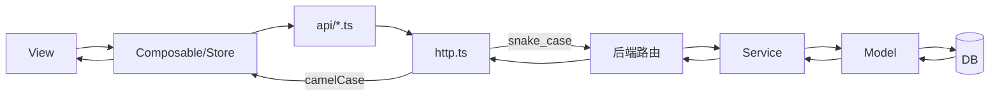
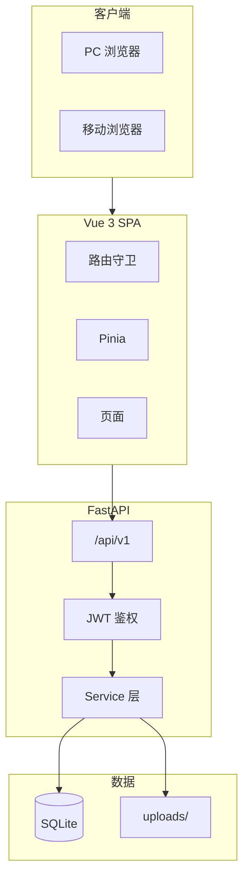
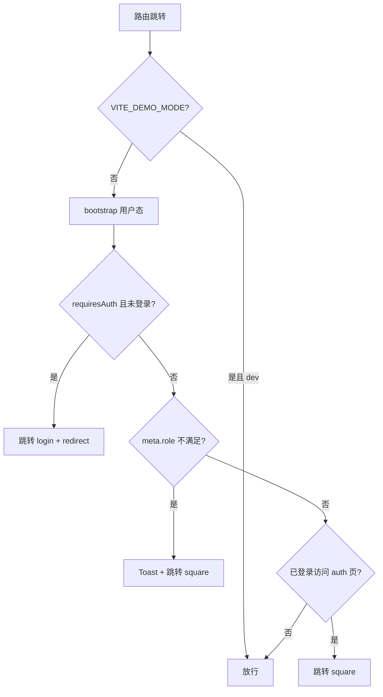
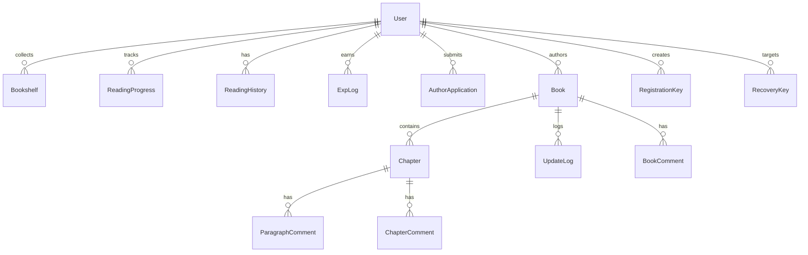

# 欲阅 · 产品需求与技术规格

| 字段 | 内容 |
|------|------|
| 项目名称 | 欲阅 |
| 开发人员 | 行云 |
| 文档版本 | v3.0 |
| 最后更新 | 2026-07-03 |
| 文档状态 | 与代码同步 |
| 配套规范 | [docs/CONVENTIONS.md](./docs/CONVENTIONS.md) |

---

## 目录

0. [规范与约束](#0-规范与约束)
1. [项目概述](#1-项目概述)
2. [技术架构](#2-技术架构)
3. [项目目录结构](#3-项目目录结构)
4. [用户角色与权限](#4-用户角色与权限)
5. [路由与导航守卫](#5-路由与导航守卫)
6. [核心用户流程](#6-核心用户流程)
7. [页面规格与交互逻辑](#7-页面规格与交互逻辑)
8. [评论体系](#8-评论体系)
9. [API 接口规范](#9-api-接口规范)
10. [数据库设计](#10-数据库设计)
11. [状态、缓存与同步策略](#11-状态缓存与同步策略)
12. [响应式与 UA 适配](#12-响应式与-ua-适配)
13. [管理后台](#13-管理后台)
14. [非功能性需求](#14-非功能性需求)
15. [实现范围](#15-实现范围)
16. [附录](#16-附录)

---

## 0. 规范与约束

完整条文见 [docs/CONVENTIONS.md](./docs/CONVENTIONS.md)。本节只列需求文档编写时的摘要；与 CONVENTIONS 冲突时以 CONVENTIONS 为准。

### 0.1 文档分工

| 文档 | 职责 |
|------|------|
| `欲阅需求分析.md` | 做什么：功能、页面、接口、表结构 |
| `docs/CONVENTIONS.md` | 怎么做：命名、分层、异常、文档格式 |
| `CONTRIBUTING.md` | 贡献入口与检查清单 |

接口、表结构、枚举变更时，需求分析与 CONVENTIONS 需同步更新。

### 0.2 命名（摘要）

| 层级 | 风格 | 示例 |
|------|------|------|
| 数据库 / API JSON | `snake_case` | `book_id`, `created_at` |
| API 路径 | `kebab-case` | `/update-logs`, `/exp-logs` |
| Python | `snake_case`；类 `PascalCase` | `book_service.py` |
| TypeScript 业务 | `camelCase`；类型 `PascalCase` | `bookId` |
| Vue 组件文件 | `PascalCase.vue` | `ReaderView.vue` |
| 枚举值 | 小写字符串 | `user`, `published` |

前后端字段映射在 `frontend/src/api/http.ts` 拦截器完成，业务代码不混用两种风格。

### 0.3 数据流（摘要）



响应格式：`{ code, message, data }`；分页 `data` 含 `items, total, page, page_size`。枚举与错误码分别定义在 `backend/app/core/constants.py` 与 `frontend/src/types/enums.ts`。

### 0.4 异常处理（摘要）

Service 层 `raise_app(ErrorCode.XXX)` → 全局 handler → 前端 `http.ts` 转 `AppError` → View 用 `handleError()` 或 `useApiAction()`。详见 CONVENTIONS §3.8。

---

## 1. 项目概述

### 1.1 产品定位

「欲阅」是以短篇小说为核心的多用户在线阅读平台，侧重沉浸式阅读、段评 / 章评 / 书评三级互动，以及作者创作与管理员运营。

### 1.2 核心能力

| 能力域 | 说明 |
|--------|------|
| 用户体系 | 注册码注册、多角色、经验与签到 |
| 内容消费 | 广场、书主页、书架、阅读页 |
| 社交互动 | 段评、章评、书评；作者置顶评论 |
| 内容创作 | 作者发布与管理作品、章节 |
| 平台运营 | 管理后台：用户、密钥、作品、申请、评论 |
| 多端适配 | UA 识别 PC / Android / iOS，布局与交互分支 |

### 1.3 设计原则

1. **导航页为公共入口**：首次访问经 `/` 完成品牌展示与登录引导；业务页需登录（开发模式 `VITE_DEMO_MODE` 除外）。
2. **权限双重校验**：前端路由守卫 + 后端 `deps` 鉴权。
3. **阅读体验优先**：阅读页全屏；目录、设置、进度在二级面板中，默认隐藏顶栏。
4. **凭证制注册**：注册码由管理员生成，一次性使用。
5. **续读路径短**：书架与阅读历史点击封面直达阅读页并恢复进度，不经书主页。

---

## 2. 技术架构

### 2.1 技术选型

| 层级 | 选型 | 说明 |
|------|------|------|
| 前端 | Vue 3 + TypeScript + Vite | Composition API |
| 路由 / 状态 | Vue Router 4 + Pinia | 守卫、懒加载 |
| HTTP | Axios | 拦截器、Token |
| 后端 | FastAPI | OpenAPI `/docs` |
| ORM | SQLAlchemy 2.x | 模型即表结构 |
| 数据库 | SQLite | 开发与生产默认；路径由 `DATABASE_URL` 配置 |
| 认证 | JWT | Access 2h，Refresh 7d |
| 密码 | bcrypt | 哈希存储 |
| 静态文件 | 本地 `uploads/` | 头像、封面；生产由后端同端口托管 |

### 2.2 部署形态

| 环境 | 形态 |
|------|------|
| 本地开发 | 前端 5173 + 后端 8000，Vite 代理 `/api` |
| 生产（Ubuntu） | 单端口（默认 9080）：后端托管 `frontend/dist` + `/api/v1` + `/uploads`，无 Nginx |

### 2.3 系统架构



---

## 3. 项目目录结构

### 3.1 仓库根目录

```
欲阅/
├── docs/
│   ├── CONVENTIONS.md
│   └── README.md
├── backend/
├── frontend/
├── scripts/           # install / start / stop / status / init_db
├── deploy/            # systemd 模板
├── 欲阅需求分析.md
├── CONTRIBUTING.md
└── README.md
```

### 3.2 后端 `backend/`

```
backend/
├── app/
│   ├── main.py                 # 入口；挂载 API、uploads、生产 SPA
│   ├── config.py               # 环境变量
│   ├── database.py             # 引擎、会话、增量 schema 补丁
│   ├── seed.py                 # init_db + 演示数据
│   ├── seed_test.py            # 重置测试库
│   │
│   ├── api/
│   │   ├── deps.py             # 鉴权、分页、角色
│   │   └── v1/
│   │       ├── router.py
│   │       ├── auth.py
│   │       ├── users.py
│   │       ├── books.py
│   │       ├── chapters.py
│   │       ├── comments.py
│   │       ├── bookshelf.py
│   │       ├── reading.py
│   │       ├── profile.py
│   │       ├── author.py
│   │       ├── upload.py
│   │       └── admin/
│   │           ├── users.py
│   │           ├── keys.py
│   │           ├── books.py
│   │           ├── applications.py
│   │           └── comments.py
│   │
│   ├── models/
│   │   ├── user.py
│   │   ├── book.py             # Book、Chapter、UpdateLog
│   │   ├── comment.py          # 三级评论
│   │   ├── bookshelf.py
│   │   ├── reading.py
│   │   └── profile.py          # 密钥、签到、经验、作者申请
│   │
│   ├── schemas/                # auth、book、comment、profile、author、admin、common
│   ├── services/               # 各模块 *_service.py + exp_service.py
│   ├── core/                   # constants、security、permissions、exceptions
│   ├── utils/                  # validators、book_access、datetime_util
│   └── data/                   # fortunes、测试故事文本
│
├── tests/
│   ├── conftest.py
│   ├── test_profile.py
│   └── test_admin_features.py
├── requirements.txt
├── .env.example
└── README.md
```

建表由 `seed.init_db()` 完成；已有库的结构变更通过 `database.run_schema_migrations()` 追加列（非 Alembic）。

### 3.3 前端 `frontend/`

```
frontend/
├── src/
│   ├── main.ts
│   ├── App.vue
│   │
│   ├── api/                    # auth、books、comments、bookshelf、reading、
│   │                           # profile、author、upload、admin、users、http
│   │
│   ├── views/
│   │   ├── landing/LandingView.vue
│   │   ├── auth/               # Login、Register、Recover
│   │   ├── square/SquareView.vue
│   │   ├── book/BookDetailView.vue
│   │   ├── reader/ReaderView.vue
│   │   ├── shelf/ShelfView.vue
│   │   ├── profile/            # Profile、Edit、Password、Exp、History、
│   │   │                       # AuthorApply、Works、ChapterManage
│   │   └── admin/              # Users、Keys、Books、Applications、Comments
│   │
│   ├── layouts/                # Default、Auth、Admin（无独立 ReaderLayout）
│   ├── components/
│   │   ├── common/             # AppHeader、AppTabBar、BookCard、EmptyState 等
│   │   ├── comment/            # CommentDock、CommentItem
│   │   └── reader/             # ReaderChapterCommentCard
│   │
│   ├── composables/            # useReader、useReaderSettings、useDevice 等
│   ├── stores/                 # user、device
│   ├── router/                 # index.ts、guards.ts
│   ├── types/                  # api、user、book、comment、enums
│   ├── utils/                  # token、appError、errorHandler、caseTransform
│   └── styles/                 # variables、reset、components、admin
│
├── vite.config.ts
├── package.json
└── README.md
```

阅读页 UI 由 `ReaderView.vue` 与 `components/reader/*`（正文块渲染、段评、章评卡片）及 composable 协同实现。

### 3.4 约定索引

| 项 | 说明 |
|----|------|
| API 前缀 | `/api/v1` |
| 上传 URL | `/uploads/...` |
| 前端路由 | History 模式；path 用 `kebab-case`，name 用 `kebab-case` |
| 命名细节 | 见 CONVENTIONS §2 |

---

## 4. 用户角色与权限

### 4.1 角色

| 角色 | 标识 | 获取方式 |
|------|------|----------|
| 访客 | `guest` | 未登录（前端无 Token） |
| 普通用户 | `user` | 注册码注册 |
| 作者 | `author` | 申请并通过审核 |
| 管理员 | `admin` | 超管指派 |
| 超级用户 | `superadmin` | 种子账号 |

```
guest ──注册──► user ──申请+审核──► author
                         admin ◄──指派── superadmin
```

### 4.2 权限矩阵

| 能力 | guest | user | author | admin | superadmin |
|------|:-----:|:----:|:------:|:-----:|:----------:|
| 导航页 / 认证页 | ✓ | ✓ | ✓ | ✓ | ✓ |
| 书籍广场等业务页（前端） | — | ✓ | ✓ | ✓ | ✓ |
| 阅读、评论、书架 | — | ✓ | ✓ | ✓ | ✓ |
| 申请作者 | — | ✓ | — | — | — |
| 管理自己的作品 | — | — | ✓ | ✓ | ✓ |
| 作者置顶段评/章评 | — | — | ✓ | ✓ | ✓ |
| 管理后台 | — | — | — | ✓ | ✓ |
| 指派/撤销管理员 | — | — | — | — | ✓ |

说明：后端部分读接口（如 `GET /books`）允许无 Token 访问；前端路由对业务页统一要求登录。

### 4.3 账号状态

| 状态 | 标识 | 行为 |
|------|------|------|
| 正常 | `active` | 正常使用 |
| 封禁 | `banned` | 登录拒绝；已登录用户下次请求返回 `40301` 并登出 |

---

## 5. 路由与导航守卫

### 5.1 前端路由表

| 路径 | name | 页面 | 布局 | 权限 |
|------|------|------|------|------|
| `/` | landing | 导航页 | 无 | 公开 |
| `/auth/login` | login | 登录 | Auth | 未登录 |
| `/auth/register` | register | 注册 | Auth | 未登录 |
| `/auth/recover` | recover | 找回密码 | Auth | 未登录 |
| `/square` | square | 书籍广场 | Default | 登录 |
| `/book/:bookId` | book | 书主页 | Default | 登录 |
| `/read/:bookId/:chapterId` | reader | 阅读页 | 无（全屏） | 登录 |
| `/shelf` | shelf | 书架 | Default | 登录 |
| `/profile` | profile | 个人中心 | Default | 登录 |
| `/profile/edit` | profile-edit | 修改资料 | Default | 登录 |
| `/profile/password` | profile-password | 修改密码 | Default | 登录 |
| `/profile/exp` | profile-exp | 经验记录 | Default | 登录 |
| `/profile/titles` | profile-titles | 阅读头衔 | Default | 登录 |
| `/profile/history` | profile-history | 阅读历史 | Default | 登录 |
| `/profile/apply-author` | profile-apply-author | 申请作者 | Default | user |
| `/profile/works` | profile-works | 作品管理 | Default | author+ |
| `/profile/works/:bookId/chapters` | profile-chapters | 章节管理 | Default | author+ |
| `/admin` | — | 重定向 | Admin | admin+ |
| `/admin/users` | admin-users | 用户管理 | Admin | admin+ |
| `/admin/keys` | admin-keys | 密钥管理 | Admin | admin+ |
| `/admin/books` | admin-books | 作品管理 | Admin | admin+ |
| `/admin/applications` | admin-applications | 作者审核 | Admin | admin+ |
| `/admin/comments` | admin-comments | 评论管理 | Admin | admin+ |

`/admin` 默认重定向到 `admin-applications`。

### 5.2 守卫逻辑

实现文件：`frontend/src/router/guards.ts`。



Token 过期（`40101`）：`http.ts` 尝试 refresh 并重放请求；失败则清 Token，由守卫跳转登录。

---

## 6. 核心用户流程

### 6.1 首次访问

```mermaid
flowchart TD
    A[访问 /] --> B{已登录?}
    B -->|否| C[导航页：登录/注册]
    C --> D[认证成功]
    D --> E[/square]
    B -->|是| E
    E --> F[书主页 / 阅读页]
```

### 6.2 续读

| 入口 | 目标 | 进度 |
|------|------|------|
| 广场卡片 | 书主页 | — |
| 书主页「开始阅读」 | 阅读页 | 有进度则恢复，否则第一章 |
| 书架封面 | 阅读页（跳过书主页） | 恢复 |
| 阅读历史 | 阅读页 | 恢复对应章节 |

### 6.3 作者创作

```mermaid
flowchart TD
    A[提交作者申请] --> B[管理员审核]
    B -->|通过| C[角色 → author]
    C --> D[/profile/works]
    D --> E[新建书籍 / 章节]
    E --> F{发布?}
    F -->|是| G[广场可见 + update_log]
    F -->|否| H[草稿，仅作者可见]
```

---

## 7. 页面规格与交互逻辑

### 7.1 导航页

| 状态 | UI |
|------|-----|
| 未登录 | 「登录」「注册」 |
| 已登录 | 「欢迎，{昵称}」「进入广场」 |

仅 Hero 区，无书籍预览或页脚。

### 7.2 认证

**注册** `/auth/register`：注册码 → 昵称、密码、头像（可选）。昵称 2–20 字唯一；密码 ≥8 位含字母和数字。

**登录** `/auth/login`：昵称或 ID + 密码。成功存 Token，跳转 `redirect` 或 `/square`。

**找回** `/auth/recover`：账号 + 找回密钥 → 设新密码 → 跳转登录。

**改密** `/profile/password`：旧密码 + 新密码。

**改资料** `/profile/edit`：`PATCH /users/me` 只提交变更字段；昵称未改时不做唯一性校验。

### 7.3 书籍广场 `/square`

| 功能 | 说明 |
|------|------|
| 分类 | Chip 单选；数据来自 `GET /books/categories` |
| 排序 | Chip：最近更新 / 字数 |
| 搜索 | 书名、作者模糊；防抖 |
| 分页 | `page_size=20` |
| 卡片 | 封面、书名、简介、分类、字数、更新时间 |

字数区间筛选（<1 万 / 1–5 万 / 5 万+）**尚未实现**。

### 7.4 书主页 `/book/:bookId`

| 区块 | 说明 |
|------|------|
| 头部 | 封面、书名、作者、分类、字数、状态 |
| 操作 | 开始阅读、加入/移出书架 |
| 简介 | 超 4 行可展开 |
| 更新日志 | 点击章节进阅读页 |
| 书评 | `CommentDock` 独立滚动区 |

书详情接口 `GET /books/{id}` 返回 `chapters` 目录，无单独 `GET /books/{id}/chapters` 路由。

**开始阅读：**

```
有 ReadingProgress → /read/:bookId/:chapterId?offset=...
无 → /read/:bookId/:firstChapterId
```

### 7.5 阅读页 `/read/:bookId/:chapterId`

主滚动区 `reader-scroll-zone` 含正文 + 章末章评预览卡片。

| 能力 | 说明 |
|------|------|
| 滚动模式 | PC 固定；移动可选上下滚动 / 左右滑动 |
| 连续阅读 | 滚至章末自动加载下一章（`useReaderScrollChain`） |
| 顶栏 | 点击正文切换显隐；3s 无操作隐藏 |
| 二级面板 | 目录、进度、设置（Tab） |
| 段评 | 有评论时段末内联角标；双击/双触打开侧栏；`useScrollLock` 锁背景 |
| 章评 | 章末 `ReaderChapterCommentCard` → 侧栏详情 |
| 正文图片 | 作家可在段落下方插入图片（marker `[img:/uploads/...]`）；阅读页与章节管理均可编辑；图片自适应边距 |
| 进度 | 滚动节流 3s 上报；切章与离开页立即上报 |

**正文块模型**：章节 `content` 按 `\n\n` 切分；整行 `[img:/uploads/xxx]` 识别为图片块（存储路径必须为 `/uploads/...` 相对路径，展示时由前端 `resolveMediaUrl` 解析）。`GET /chapters/{id}` 返回 `blocks`（`text` / `image`）与兼容字段 `paragraphs`（仅文本段）。段评 `paragraph_index` 仅计数文本段，图片块不参与索引。保存时后端会将历史脏数据 `[img:http://.../uploads/xxx]` 规范化为相对路径。

**作家编辑模式**（`book.author_id === 当前用户`）：

| 场景 | 交互 |
|------|------|
| 阅读页 | 顶栏「编辑正文」进入编辑态；顶栏显示「编辑中」标签与「完成」按钮；翻页模式下编辑时切换为块级滚动视图 |
| 块级插入 | 每段文本下方常驻「+ 插入图片」条（`AuthorBlockInsertBar`），移动端无需 hover |
| 图片块 | 编辑态显示 accent 描边；支持替换 / 删除（`AuthorImageBlockChrome`） |
| 段评 | 编辑态隐藏段评角标，禁用双击/长按打开段评；完成编辑后恢复 |
| 保存 | 上传 → 写入 marker → `PATCH /author/chapters/{id}`；Toast 反馈 |

**章节管理页**（`/profile/works/:bookId/chapters`）：双栏编辑器——左栏原始 textarea（可直编 marker），右栏 `AuthorBlockEditor` 块预览与插入，与阅读页编辑 UI 一致。管理后台章节编辑复用同一组件。

阅读设置存 `localStorage`，登录后可通过 `GET/PUT /profile/reader-settings` 云同步。

### 7.6 书架 `/shelf`

点击封面直达阅读页；删除需确认；默认按最后阅读时间倒序。

### 7.7 个人中心 `/profile`

签到 → 运势文案 + 经验 + 头衔进度；入口：改资料、改密、阅读头衔、经验、历史、申请作者（user）、作品管理（author+）、管理后台（admin+）。

**阅读头衔**：经验累计映射 10 级头衔（Lv.1 门外读者 … Lv.10 欲阅宗师）；纯展示，与 `role` 正交。个人中心显示进度条；签到跨级时弹层提示「恭喜晋升」。

**作品管理** `/profile/works`：草稿/已发布/已下架；封面上传；章节管理在 `/profile/works/:bookId/chapters`。

### 7.8 错误与空状态

| 场景 | 处理 |
|------|------|
| 网络失败 | 前端 `code=-1`，Toast |
| 表单校验 | `handleError({ silent: true })` |
| 401 / 40101 | 跳转登录或 refresh |
| 40301 封禁 | Toast + logout |
| 进度上报失败 | `silent: true`，本地队列重试 |

---

## 8. 评论体系

### 8.1 三级对照

| 类型 | 锚点 | 页面 | 排序 |
|------|------|------|------|
| 段评 | `chapter_id` + `paragraph_index` | 阅读页 | 作者置顶 → 时间倒序 |
| 章评 | `chapter_id` | 阅读页章末 | 同上 |
| 书评 | `book_id` | 书主页 | 时间倒序 |

### 8.2 规则

- 登录后可发；1–500 字
- 一级回复（`parent_id` 指向顶级评论）
- 每段/每章最多一条作者置顶
- 用户可删自己的；管理员可隐藏（`is_hidden`）
- 正文按 `\n\n` 切段落；无段评时不显示角标
- 评论响应含 `avatar`、`level`、`title`（展示用，与经验头衔一致）

### 8.3 评论展示

书评、章评、段评列表均显示用户头像（圆形）与头衔徽章；管理后台评论审核列表含头像列。

### 8.4 滚动隔离

书评 `CommentDock`、段评/章评浮层均：列表区 `overflow-y: auto`，发表区固定底部；浮层打开时 `useScrollLock`。

---

## 8A. 阅读头衔系统

| 等级 | 头衔 | 累计经验 |
|------|------|----------|
| Lv.1 | 门外读者 | 0 |
| Lv.2 | 初窥门径 | 30 |
| Lv.3 | 书香初染 | 80 |
| Lv.4 | 闲章散笔 | 150 |
| Lv.5 | 夜读者 | 250 |
| Lv.6 | 书斋常客 | 400 |
| Lv.7 | 字里行间 | 600 |
| Lv.8 | 万卷书生 | 900 |
| Lv.9 | 阅尽千帆 | 1300 |
| Lv.10 | 欲阅宗师 | 1800 |

- 等级由 `User.exp` 实时计算，无独立 DB 字段
- 常量定义：`backend/app/core/constants.py` → `TITLE_LEVELS`；前端 `frontend/src/constants/titles.ts`
- `GET /users/me` 与签到响应含 `level`、`title`、`exp_in_level`、`exp_to_next`

---

## 9. API 接口规范

Base URL：`/api/v1`。请求头：`Authorization: Bearer <access_token>`（公开接口除外）。

响应：`{ "code": 0, "message": "ok", "data": ... }`。分页 `data`：`items, total, page, page_size`。

### 9.1 认证 `/auth`

| 方法 | 路径 | 说明 | 权限 |
|------|------|------|------|
| POST | `/auth/register/verify` | 校验注册码 | 公开 |
| POST | `/auth/register` | 注册 | 公开 |
| POST | `/auth/login` | 登录 | 公开 |
| POST | `/auth/refresh` | 刷新 Token | 公开 |
| POST | `/auth/recover` | 找回密码 | 公开 |
| POST | `/auth/logout` | 登出 | 登录 |

### 9.2 用户 `/users`

| 方法 | 路径 | 说明 |
|------|------|------|
| GET | `/users/me` | 当前用户 |
| PATCH | `/users/me` | 改昵称、头像（部分更新） |
| POST | `/users/me/password` | 改密码 |

### 9.3 书籍 `/books`

| 方法 | 路径 | 说明 |
|------|------|------|
| GET | `/books/categories` | 分类列表 |
| GET | `/books` | 广场列表（`category`, `keyword`, `sort`, 分页） |
| GET | `/books/{book_id}` | 详情（含章节目录） |
| GET | `/books/{book_id}/update-logs` | 更新日志 |
| GET | `/books/{book_id}/comments` | 书评列表 |
| POST | `/books/{book_id}/comments` | 发表书评 |

### 9.4 章节 `/chapters`

| 方法 | 路径 | 说明 |
|------|------|------|
| GET | `/chapters/{chapter_id}` | 章节正文（含 `blocks`、`paragraphs`） |

### 9.5 评论 `/comments`

| 方法 | 路径 | 说明 |
|------|------|------|
| GET | `/comments/paragraph/by-chapter/{chapter_id}` | 整章段评汇总 |
| GET | `/comments/paragraph` | 单段列表（`chapter_id`, `paragraph_index`） |
| POST | `/comments/paragraph` | 发表段评 |
| GET | `/comments/chapter/{chapter_id}` | 章评列表 |
| POST | `/comments/chapter` | 发表章评 |
| DELETE | `/comments/{comment_id}` | 删除（query: `type`） |
| POST | `/comments/{comment_id}/pin` | 作者置顶（query: `type`） |

### 9.6 书架 `/bookshelf`

| 方法 | 路径 | 说明 |
|------|------|------|
| GET | `/bookshelf` | 我的书架 |
| POST | `/bookshelf` | 加入 `{ book_id }` |
| DELETE | `/bookshelf/{book_id}` | 移出 |

### 9.7 阅读 `/reading`

| 方法 | 路径 | 说明 |
|------|------|------|
| GET | `/reading/progress/{book_id}` | 获取进度 |
| PUT | `/reading/progress` | 更新 `{ book_id, chapter_id, offset }` |
| GET | `/reading/history` | 历史（分页） |

### 9.8 个人 `/profile`

| 方法 | 路径 | 说明 |
|------|------|------|
| POST | `/profile/check-in` | 签到 |
| GET | `/profile/check-in/status` | 今日签到状态 |
| GET | `/profile/exp-logs` | 经验记录 |
| GET | `/profile/titles` | 全部头衔与当前进度 |
| POST | `/profile/author-application` | 提交作者申请 |
| GET | `/profile/author-application` | 申请状态 |
| GET | `/profile/reader-settings` | 阅读设置 |
| PUT | `/profile/reader-settings` | 保存阅读设置 |

### 9.9 作者 `/author`

| 方法 | 路径 | 说明 |
|------|------|------|
| GET | `/author/books` | 我的作品 |
| POST | `/author/books` | 新建 |
| PATCH | `/author/books/{book_id}` | 编辑 |
| POST | `/author/books/{book_id}/publish` | 发布 |
| POST | `/author/books/{book_id}/unpublish` | 下架 |
| DELETE | `/author/books/{book_id}` | 删除 |
| GET | `/author/books/{book_id}/chapters` | 章节列表 |
| POST | `/author/books/{book_id}/chapters` | 新增章节 |
| GET | `/author/chapters/{chapter_id}` | 章节详情（作者） |
| PATCH | `/author/chapters/{chapter_id}` | 编辑章节 |
| DELETE | `/author/chapters/{chapter_id}` | 删除章节 |
| PUT | `/author/books/{book_id}/chapters/reorder` | 排序 |

### 9.10 上传 `/upload`

| 方法 | 路径 | 说明 |
|------|------|------|
| POST | `/upload/image` | 图片上传，返回 `{ url }` |

### 9.11 管理 `/admin`

| 方法 | 路径 | 说明 | 权限 |
|------|------|------|------|
| GET | `/admin/users` | 用户列表 | admin+ |
| PATCH | `/admin/users/{user_id}/status` | 封禁/解封 | admin+ |
| PATCH | `/admin/users/{user_id}/role` | 改角色 | superadmin |
| POST | `/admin/keys/registration` | 批量生成注册码 | admin+ |
| GET | `/admin/keys/registration` | 注册码列表 | admin+ |
| POST | `/admin/keys/recovery` | 生成找回密钥 | admin+ |
| GET | `/admin/books` | 全站书籍 | admin+ |
| PATCH | `/admin/books/{book_id}/status` | 强制下架 | admin+ |
| DELETE | `/admin/books/{book_id}` | 强制删除 | admin+ |
| GET | `/admin/chapters/by-book/{book_id}` | 书籍章节列表 | admin+ |
| GET | `/admin/chapters/{chapter_id}` | 章节详情（含正文） | admin+ |
| PATCH | `/admin/chapters/{chapter_id}` | 编辑章节正文/标题 | admin+ |
| GET | `/admin/applications` | 作者申请列表 | admin+ |
| PATCH | `/admin/applications/{app_id}` | 审核 | admin+ |
| GET | `/admin/comments` | 评论列表（`type`, `visibility`, 分页） | admin+ |
| POST | `/admin/comments/{comment_id}/hide` | 隐藏 | admin+ |
| POST | `/admin/comments/{comment_id}/unhide` | 恢复 | admin+ |

---

## 10. 数据库设计

### 10.1 ER 概览



### 10.2 表结构

字段类型以 SQLite 为准；枚举存 `String(20)` 小写值。

#### `users`

| 字段 | 类型 | 说明 |
|------|------|------|
| id | INTEGER PK | |
| nickname | VARCHAR(20) UNIQUE | |
| password_hash | VARCHAR(255) | bcrypt |
| avatar | VARCHAR(255) | |
| role | VARCHAR(20) | guest/user/author/admin/superadmin |
| status | VARCHAR(20) | active/banned |
| exp | INTEGER | 经验 |
| reader_settings | TEXT NULL | JSON 阅读设置 |
| created_at / updated_at | DATETIME | |

#### `registration_keys` / `recovery_keys`

注册码：`code`, `status`, `created_by`, `used_by`, `expires_at`, `used_at`, `created_at`。

找回密钥：`code`, `user_id`, `status`, `created_by`, `expires_at`, `used_at`, `created_at`。

#### `books`

| 字段 | 说明 |
|------|------|
| id, title, author_id, description, cover, category | |
| word_count | 冗余总字数 |
| status | draft / published / unpublished |
| admin_delisted | 管理员强制下架标记 |
| created_at / updated_at | |

#### `chapters`

| 字段 | 说明 |
|------|------|
| id, book_id, title, content | |
| word_count, sort_order | |
| created_at / updated_at | |

#### `update_logs`

`book_id`, `chapter_id`, `added_words`, `created_at`

#### 评论表

`book_comments` / `chapter_comments` / `paragraph_comments`：

公共：`id`, `user_id`, `content`, `parent_id`, `is_pinned`, `is_hidden`, `created_at`

段评额外：`chapter_id`, `paragraph_index`

#### `bookshelf`

`user_id` + `book_id` 联合主键，`created_at`

#### `reading_progress`

`id`, `user_id`, `book_id`（联合唯一）, `chapter_id`, `offset`（0–1）, `updated_at`

#### `reading_history`

`id`, `user_id`, `book_id`, `chapter_id`, `created_at`

#### `check_ins`

`user_id` + `check_date` 唯一；`fortune_text`, `exp_gained`, `created_at`

#### `exp_logs`

`user_id`, `source`（check_in/read/comment）, `amount`, `created_at`

#### `author_applications`

`user_id`, `reason`, `status`, `review_note`, `reviewed_by`, `created_at`, `reviewed_at`

---

## 11. 状态、缓存与同步策略

### 11.1 前端状态

| 模块 | 内容 | 持久化 |
|------|------|--------|
| `stores/user` | Token、userInfo | localStorage（token） |
| `stores/device` | desktop/android/ios | sessionStorage |
| `useReaderSettings` | 字号、主题、翻页模式等 | localStorage + 云端 |
| 阅读页 composable | 当前书章、面板开关 | 内存 |

### 11.2 阅读进度

| 策略 | 值 |
|------|-----|
| 上报节流 | 3s |
| 切章 / 离开页 | 立即 |
| 失败 | `useProgressQueue` 本地队列重试 |
| 冲突 | 以服务端 `updated_at` 为准 |

---

## 12. 响应式与 UA 适配

### 12.1 终端识别

`composables/useDevice.ts`：UA 判断 `desktop` / `android` / `ios`，写入 `stores/device`。

### 12.2 断点

| 断点 | 布局 |
|------|------|
| < 768px | 底部 TabBar、单列、阅读菜单底部 Sheet |
| ≥ 768px | 顶栏 Header、阅读菜单右侧抽屉 |
| > 1024px | 广场多列卡片 |

### 12.3 阅读差异

| 场景 | desktop | mobile |
|------|---------|--------|
| 翻页模式 | 固定上下滚动 | 可选 scroll / slide |
| 段评入口 | 双击段落 / 点击角标 | 双触段落 |
| 安全区 | — | iOS safe-area |

---

## 13. 管理后台

布局：`AdminLayout` 左侧栏 + 顶栏 + 表格主区。

| 菜单 | 路由 | 功能 |
|------|------|------|
| 作者审核 | `/admin/applications` | 通过/拒绝 + 备注 |
| 用户 | `/admin/users` | 封禁、角色（超管） |
| 密钥 | `/admin/keys` | 注册码批量生成、找回密钥 |
| 作品 | `/admin/books` | 强制下架/删除 |
| 评论 | `/admin/comments` | 按类型筛选、隐藏/恢复 |

---

## 14. 非功能性需求

| 类别 | 指标 |
|------|------|
| 性能 | 章节切换 < 500ms；API P95 < 300ms（目标） |
| 安全 | HTTPS、bcrypt、JWT 过期、上传白名单、生产强 SECRET_KEY |
| 日志 | 请求与异常堆栈；不记录密码与 Token |
| 可维护 | OpenAPI `/docs`；分层清晰 |

---

## 15. 实现范围

当前代码已覆盖以下模块（非未来规划）：

| 模块 | 状态 |
|------|------|
| 导航、认证、广场、书主页、阅读、书架 | 已实现 |
| 段评、章评、书评、置顶、后台隐藏 | 已实现 |
| 阅读设置、进度同步、签到经验、阅读头衔 | 已实现 |
| 章节正文图片块、作家/管理员图片管理 | 已实现 |
| 评论头像与头衔展示 | 已实现 |
| 作者作品/章节 CRUD、发布下架 | 已实现 |
| 管理后台（用户、密钥、书籍、申请、评论） | 已实现 |
| 阅读设置云同步、左右滑动翻页、UA 适配 | 已实现 |
| 广场字数区间筛选 | 未实现 |

---

## 16. 附录

### 附录 A：术语表

| 术语 | 定义 |
|------|------|
| 注册码 | 管理员生成的单次注册凭证 |
| 找回密钥 | 指定账号的单次密码重置凭证 |
| offset | 章内阅读位置，0–1 表示滚动比例 |
| CommentDock | 书主页书评独立滚动容器 |
| 正文图片块 | 章节 content 中 `[img:/uploads/...]` 单行 marker |
| 阅读头衔 | 经验累计映射的展示等级，与权限 role 无关 |

### 附录 B：书籍分类

玄幻、都市、科幻、悬疑、言情、历史、其他（`BOOK_CATEGORIES`）

### 附录 C：运势文案

`backend/app/data/fortunes.py`，签到随机抽取。

### 附录 D：错误码

以代码为准：

| code | 含义 |
|------|------|
| 0 | 成功 |
| 400 | 参数错误 |
| 401 | 未认证 |
| 403 | 无权限 |
| 404 | 资源不存在 |
| 409 | 冲突 |
| 500 | 服务器错误 |
| 40001 | 注册码无效 |
| 40002 | 昵称已存在 |
| 40101 | Token 过期 |
| 40301 | 账号封禁 |
| 40302 | 需要作者权限 |
| 40303 | 需要管理员权限 |
| 40401 | 书籍不存在 |
| 40402 | 章节不存在 |
| 40901 | 今日已签到 |
| -1 | 前端网络错误（仅前端） |

定义：`backend/app/core/constants.py`、`frontend/src/types/enums.ts`。

### 附录 E：文档索引

| 文档 | 路径 |
|------|------|
| 文档索引与阅读顺序 | [docs/README.md](./docs/README.md) |
| 项目概述 | [docs/01-项目概述.md](./docs/01-项目概述.md) |
| 需求与开发完成度 | [docs/02-需求与开发完成度.md](./docs/02-需求与开发完成度.md) |
| 架构设计 | [docs/03-架构设计.md](./docs/03-架构设计.md) |
| 命名与实现规范 | [docs/04-命名与实现规范.md](./docs/04-命名与实现规范.md) |
| 数据库设计 | [docs/05-数据库设计.md](./docs/05-数据库设计.md) |
| 后端实现 | [docs/06-后端实现.md](./docs/06-后端实现.md) |
| 前端实现 | [docs/07-前端实现.md](./docs/07-前端实现.md) |
| API 接口文档 | [docs/08-API接口文档.md](./docs/08-API接口文档.md) |
| 部署与运维 | [docs/09-部署与运维.md](./docs/09-部署与运维.md) |
| 测试 | [docs/10-测试.md](./docs/10-测试.md) |
| 未完成需求与规划 | [docs/11-未完成需求与规划.md](./docs/11-未完成需求与规划.md) |
| 开发规范 | [docs/CONVENTIONS.md](./docs/CONVENTIONS.md) |
| 贡献指南 | [CONTRIBUTING.md](./CONTRIBUTING.md) |
| Cursor 规则 | [.cursor/rules/yuyue-conventions.mdc](./.cursor/rules/yuyue-conventions.mdc) |

---

*文档结束 · 欲阅 v3.0* 
